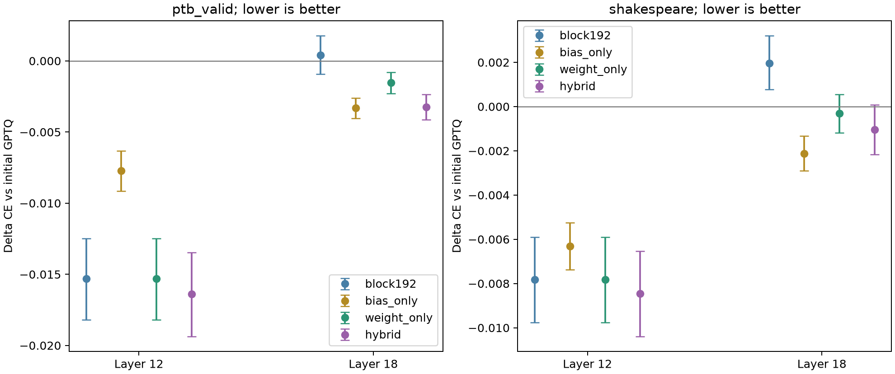
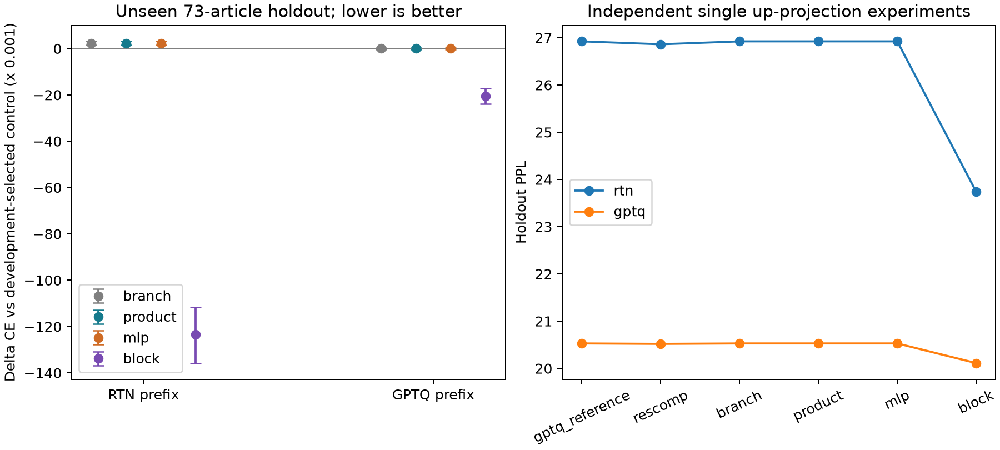

# 最终完整实验报告：七轮迭代、保守修复与研究判断

报告日期：2026-09-28。第六轮运行于9月27日，第七轮运行于9月28日；后文附有前六轮完整报告，保留当时结论与本轮如何修正它们。

## 1. 最终判断

组合方案在本轮两个层、两份新语料中均有正向结果，但超过廉价均值补偿的额外优势不够统一。值得有限继续，优先保留简单基线，暂不扩大复杂敏感度设计。

你的原始想法——利用任务敏感度改善量化误差补偿——工程上可以实现，但七轮证据仍要求区分三件事：梯度加权是否提供额外价值，完整块重建是否泛化，以及简单均值修正能解释多少收益。最后一轮改进重点是限制大容量修复、分离均值漂移和改善选参方式，不再把更多梯度信息默认视为进步。

PPL是困惑度，越低越好。每个比较都在相同模型、前缀、目标层和数据上进行；不同轮、不同语料的绝对PPL不能直接相减当作进步幅度。

**最关键的边界：** 本轮hybrid相对初始GPTQ在四条件均改善，且每个条件都是3/3seed；但第18层Shakespeare的95%连续块区间仍跨0。简单bias_only四条件也都是3/3改善，区间均支持负向CE差。hybrid在第12层两语料超过bias_only，在第18层却没有额外优势。因此可以支持有限继续，不能宣称复杂方案全面胜出。

| 报告简称 | 白话含义 |
|---|---|
| gptq | 已量化的初始权重，作为同条件基线 |
| bias_only | 不改量化码，只加896维输出均值修正 |
| block192 | 用完整块误差训练192步的权重 |
| weight_only | 在初始、半幅和完整修复中，用两个开发域选一个，无额外偏置 |
| hybrid | 用两个开发域选择修复强度，并加对应均值修正 |
| wiki_only_hybrid | 同一组候选，只按WikiText选参，检验选择规则的作用 |

## 2. 为什么继续修改第六轮方案

第五轮含残差完整块重建在新WikiText文章上明显改善。第六轮进一步加入两个修复位置、更多步数、弱token加权、方向罚项、受限方向曲率、连续权重与低容量偏置，并在PTB上评估。它同时发现了成功和失效：

- 第12层固定192步block在PTB的平均PPL为44.0570，初始GPTQ为44.6548，说明原方案有一定外部迁移能力。
- 开发选出的576步block变成44.3675；更多步数并没有更好的外部泛化。第18层block576为44.7781，反而高于初始GPTQ的44.6908。
- 第12层token576相对block576约改善0.229%，但仍差于固定192步block；受限方向方案的平均收益主要由一个seed贡献。不能只拿最有利的比较说任务加权已成功。
- 仅增加896维块输出均值偏置，在第六轮PTB两层都改善，且都是3/3seed；这比增加复杂敏感度更值得优先检查。

因此第七轮不继续延长训练，而是检验：将已学到的权重修复收缩一半，再独立修正均值，是否能减少对校准域的过度适应。同时用两个已见开发域共同选参，避免只按WikiText排名。

## 3. 第七轮具体方法与工作量

沿用固定版本Qwen2.5-0.5B、GPTQ前12块、目标层12/18的mlp.up_proj、校准seed0/1/2各64×256、F32运算和固定逐行W4网格。层18之前的12–17块仍浮点；两个目标独立实验，不代表同时量化或修复两个层。

q0为第六轮初始GPTQ整数码，q1为192步未加权block的整数码。只试tau=0、0.5、1：Q_tau=scale×round((1−tau)q0+tau q1)。所有候选仍位于原[-8,7]固定网格；半整数采用PyTorch的舍入规则，不把浮点插值权重当作4-bit结果。

每种权重再比较是否加b_tau=mean_cal(Bf−Bq_tau)，在目标块输出加这个896维向量。偏置只用WikiText校准数据拟合；保存为F32，额外参数量896，原始参数字节数3584，即3.5 KiB，不含框架执行开销。它改变了模型的块输出，必须与纯权重方案分开评价；本轮未测真实int4推理速度。

对固定候选，令e=Bq−Bf，则均值最优偏置为−mean(e)，校准MSE分解为均值项与中心化误差项之和。偏置能消去均值项，但不保证新数据的任务CE下降。本轮是在已有权重上后拟合偏置，没有重新训练一个“中心化误差”权重目标，也没有联合优化权重和偏置。

| 候选 | 权重修复 | 块输出偏置 | 来源 |
|---|---|---|---|
| tau0 | 初始GPTQ | 无 | 复用第六轮 |
| tau0_bias | 初始GPTQ | 原均值修正 | 复用第六轮 |
| tau0.5 | 半幅修复后重新取整 | 无 | 本轮新计算 |
| tau0.5_bias | 半幅修复后重新取整 | 重新拟合均值 | 本轮新计算 |
| tau1 | 原192步完整块权重 | 无 | 复用第六轮 |
| tau1_bias | 原192步完整块权重 | 重新拟合均值 | 本轮新计算 |

6种候选×2层×3seed=36条开发条件，其中18条新计算、18条明确复用旧权重与成绩。旧初始GPTQ还在两开发域逐seed复算CE检查。没有把36条全部计成新训练或独立假设。所有新权重只是对已有192步结果后处理，本轮没有额外Adam训练。

## 4. 如何选配置，如何保留真正未见的确认数据

第六轮PTB test成绩已经看过，本轮将那128个窗口明确转为开发数据；原WikiText validation64窗口是另一开发域。对每层、每候选，在每域先平均三个seed的CE差（候选减初始GPTQ），再取两域差值中较差的一个，选择使它最小的共同配置。

weight_only从三个无偏置强度选择；hybrid从三个偏置候选和初始GPTQ回退项选择。回退项在两域的差值都为0，避免强行选择开发阶段已有明显负作用的方法。两个族都不按每个seed分别挑最好参数。此规则只保障已观察开发均值，不保证新域或每个seed必然改善。

| 层 | 方案 | 冻结的共同配置 | Wiki开发ΔCE | 已见PTB开发ΔCE | 较差域ΔCE |
|---|---|---|---:|---:|---:|
| 12 | weight_only | tau1 | -0.0204783 | -0.0134902 | -0.0134902 |
| 12 | hybrid | tau1_bias | -0.0211058 | -0.0146197 | -0.0146197 |
| 12 | wiki_only_hybrid | tau1_bias | -0.0211058 | -0.0146197 | -0.0146197 |
| 18 | weight_only | tau0.5 | -0.0047031 | -0.0012130 | -0.0012130 |
| 18 | hybrid | tau0.5_bias | -0.0043692 | -0.0031528 | -0.0031528 |
| 18 | wiki_only_hybrid | tau1_bias | -0.0060122 | -0.0002168 | -0.0002168 |

wiki_only_hybrid是确认前追加的选择器消融：使用与hybrid完全相同的候选池，只看Wiki开发CE。没有新增权重、训练或超参数；若与hybrid选择相同，外部结果即为别名，不能说双域选择贡献了改进。

新确认数据全部在上述选择和权重哈希冻结后才计算模型指标：

- **ptb_valid**：[固定版本来源](https://raw.githubusercontent.com/wojzaremba/lstm/76870253cfca069477f06b7056af87f98490b6eb/data/ptb.valid.txt)，commit `76870253cfca069477f06b7056af87f98490b6eb`，SHA256 `c9fe6985fe0d4ccb578183407d7668fc6066c20700cb4cf87d8ff1cc34df1bf2`。
- **shakespeare**：[固定版本来源](https://raw.githubusercontent.com/karpathy/char-rnn/6f9487a6fe5b420b7ca9afb0d7c078e37c1d1b4e/data/tinyshakespeare/input.txt)，commit `6f9487a6fe5b420b7ca9afb0d7c078e37c1d1b4e`，SHA256 `86c4e6aa9db7c042ec79f339dcb96d42b0075e16b8fc2e86bf0ca57e2dc565ed`。

PTB使用此前未评估的官方validation文件，在本项目中充当新确认集，不能叫成标准官方test成绩。Shakespeare是本轮首次评估的新文本来源。两者均按Qwen分词，选32个连续1024-token块，每块分4个非重叠256窗口，各128窗口、32640计分token。

已经检查与旧校准、开发及已用测试的精确token窗口哈希无交集，也检查两个新集互不重叠。不能由此保证没有语义重复，或预训练模型没见过这些公开文本。32块不是32篇独立文章，长距离文本依赖仍可能存在。

统计先在同窗口平均3seed差值，再平均每4窗口块，配对重采样32块10000次。区间为探索性，未做多重比较校正；不能把token数、窗口数乘seed数当独立样本量。

## 5. 两份新确认集完整结果

原始浮点模型参考PPL：ptb_valid=40.604680；shakespeare=52.135613。下表是前缀量化加单目标修复，并非完整模型W4。

| 语料 | 层 | 方法 | 冻结配置 | 平均PPL | 相对GPTQ变化 | 赢的seed |
|---|---|---|---|---:|---:|---:|
| ptb_valid | 12 | weight_only | tau1 | 48.804082 | -1.5195% | 3/3 |
| ptb_valid | 12 | hybrid | tau1_bias | 48.752248 | -1.6240% | 3/3 |
| ptb_valid | 12 | wiki_only_hybrid | tau1_bias | 48.752248 | -1.6240% | 3/3 |
| ptb_valid | 12 | gptq | tau0 | 49.556570 | +0.0000% | 0/3 |
| ptb_valid | 12 | bias_only | tau0_bias | 49.175371 | -0.7705% | 3/3 |
| ptb_valid | 12 | block192 | tau1 | 48.804082 | -1.5195% | 3/3 |
| ptb_valid | 18 | weight_only | tau0.5 | 49.495819 | -0.1527% | 2/3 |
| ptb_valid | 18 | hybrid | tau0.5_bias | 49.411616 | -0.3227% | 3/3 |
| ptb_valid | 18 | wiki_only_hybrid | tau1_bias | 49.562792 | -0.0177% | 2/3 |
| ptb_valid | 18 | gptq | tau0 | 49.571523 | +0.0000% | 0/3 |
| ptb_valid | 18 | bias_only | tau0_bias | 49.407492 | -0.3312% | 3/3 |
| ptb_valid | 18 | block192 | tau1 | 49.592310 | +0.0418% | 2/3 |
| shakespeare | 12 | weight_only | tau1 | 66.977443 | -0.7800% | 3/3 |
| shakespeare | 12 | hybrid | tau1_bias | 66.935853 | -0.8411% | 3/3 |
| shakespeare | 12 | wiki_only_hybrid | tau1_bias | 66.935853 | -0.8411% | 3/3 |
| shakespeare | 12 | gptq | tau0 | 67.504886 | +0.0000% | 0/3 |
| shakespeare | 12 | bias_only | tau0_bias | 67.079545 | -0.6292% | 3/3 |
| shakespeare | 12 | block192 | tau1 | 66.977443 | -0.7800% | 3/3 |
| shakespeare | 18 | weight_only | tau0.5 | 67.442717 | -0.0314% | 2/3 |
| shakespeare | 18 | hybrid | tau0.5_bias | 67.393041 | -0.1048% | 3/3 |
| shakespeare | 18 | wiki_only_hybrid | tau1_bias | 67.580260 | +0.1731% | 0/3 |
| shakespeare | 18 | gptq | tau0 | 67.464023 | +0.0000% | 0/3 |
| shakespeare | 18 | bias_only | tau0_bias | 67.320795 | -0.2118% | 3/3 |
| shakespeare | 18 | block192 | tau1 | 67.596353 | +0.1970% | 0/3 |

PPL为各seed PPL的算术平均；相对PPL变化为exp(平均配对ΔCE)−1，与两个算术均值相除略有差别。gptq对自身的胜出数为0，不表示失败。若所选配置与某个固定参考相同，则复用该评估并明确是别名，不算额外独立模型。

确认阶段共30个不同的候选/层/seed组合，在两份新文本上各评估一次；加两个浮点参考，共62次完整数据集评估。报告另有同一权重的方案别名，不能据此增加独立实验数量。



## 6. 组合修复是否真的超过廉价均值补偿

| 语料 | 层 | hybrid − bias_only ΔCE | 相对PPL变化 | 95%连续块区间 | 赢的seed |
|---|---|---:|---:|---|---:|
| ptb_valid | 12 | -0.0086382 | -0.8601% | [-0.0106928, -0.0065627] | 3/3 |
| ptb_valid | 18 | +0.0000852 | +0.0085% | [-0.0007171, +0.0008648] | 1/3 |
| shakespeare | 12 | -0.0021342 | -0.2132% | [-0.0038555, -0.0004394] | 2/3 |
| shakespeare | 18 | +0.0010711 | +0.1072% | [+0.0002277, +0.0019131] | 1/3 |

筛选要求比bias_only至少改善0.1%、区间上界<0且至少赢2/3seed，并且在两层×两新语料四条件中都成立。这是控制投入的实用门槛，不是统计定律。没有达到时，应优先考虑偏置的低成本，不能只报告组合相对初始GPTQ的收益。

| 方法 | 四条件均改善GPTQ且至少赢2/3seed | 四条件区间均支持改善GPTQ | 四条件都满足相对bias的额外收益门槛 |
|---|---|---|---|
| weight_only | 是 | 否 | 否 |
| hybrid | 是 | 否 | 否 |
| bias_only | 是 | 是 | 否 |
| block192 | 否 | 否 | 否 |

组合方案在本轮两个层、两份新语料中均有正向结果，但超过廉价均值补偿的额外优势不够统一。值得有限继续，优先保留简单基线，暂不扩大复杂敏感度设计。

同候选池的双域选择与只看Wiki选择的直接对照：

| 语料 | 层 | 双域hybrid − Wiki-only ΔCE | 相对PPL | 95%连续块区间 |
|---|---|---:|---:|---|
| ptb_valid | 12 | +0.0000000 | +0.0000% | [+0.0000000, +0.0000000] |
| ptb_valid | 18 | -0.0030546 | -0.3050% | [-0.0037829, -0.0023587] |
| shakespeare | 12 | +0.0000000 | +0.0000% | [+0.0000000, +0.0000000] |
| shakespeare | 18 | -0.0027781 | -0.2774% | [-0.0034461, -0.0021168] |

## 7. 逐seed结果及全部开发条件

| 语料 | 层 | 方法 | seed0 PPL | seed1 PPL | seed2 PPL |
|---|---|---|---:|---:|---:|
| ptb_valid | 12 | gptq | 49.342467 | 49.698369 | 49.628872 |
| ptb_valid | 12 | bias_only | 48.777205 | 49.268642 | 49.480264 |
| ptb_valid | 12 | weight_only | 48.418383 | 48.971574 | 49.022289 |
| ptb_valid | 12 | hybrid | 48.389404 | 48.864106 | 49.003235 |
| ptb_valid | 12 | wiki_only_hybrid | 48.389404 | 48.864106 | 49.003235 |
| ptb_valid | 12 | block192 | 48.418383 | 48.971574 | 49.022289 |
| ptb_valid | 18 | gptq | 49.362105 | 49.745250 | 49.607215 |
| ptb_valid | 18 | bias_only | 49.133040 | 49.562535 | 49.526902 |
| ptb_valid | 18 | weight_only | 49.279871 | 49.580220 | 49.627368 |
| ptb_valid | 18 | hybrid | 49.174070 | 49.485592 | 49.575185 |
| ptb_valid | 18 | wiki_only_hybrid | 49.328256 | 49.604904 | 49.755216 |
| ptb_valid | 18 | block192 | 49.346039 | 49.664377 | 49.766516 |
| shakespeare | 12 | gptq | 68.371772 | 67.587534 | 66.555353 |
| shakespeare | 12 | bias_only | 67.911189 | 67.094100 | 66.233345 |
| shakespeare | 12 | weight_only | 67.700658 | 67.107593 | 66.124078 |
| shakespeare | 12 | hybrid | 67.579882 | 67.115282 | 66.112394 |
| shakespeare | 12 | wiki_only_hybrid | 67.579882 | 67.115282 | 66.112394 |
| shakespeare | 12 | block192 | 67.700658 | 67.107593 | 66.124078 |
| shakespeare | 18 | gptq | 68.293664 | 67.519423 | 66.578983 |
| shakespeare | 18 | bias_only | 68.152264 | 67.281985 | 66.528135 |
| shakespeare | 18 | weight_only | 68.197713 | 67.595161 | 66.535277 |
| shakespeare | 18 | hybrid | 68.164012 | 67.491938 | 66.523174 |
| shakespeare | 18 | wiki_only_hybrid | 68.381602 | 67.565885 | 66.793295 |
| shakespeare | 18 | block192 | 68.368154 | 67.627178 | 66.793729 |

以下每行平均三个seed，12行覆盖36条开发条件；逐seed原表见CSV。

| 层 | 候选 | Wiki开发PPL | 已见PTB开发PPL | 较差域ΔCE | 来源 |
|---|---|---:|---:|---:|---|
| 12 | tau0 | 23.007756 | 44.654829 | +0.0000000 | 复用第六轮 |
| 12 | tau0_bias | 22.931227 | 44.286800 | -0.0033299 | 复用第六轮 |
| 12 | tau1 | 22.541263 | 44.057048 | -0.0134902 | 复用第六轮 |
| 12 | tau0.5 | 22.724160 | 44.150654 | -0.0113626 | 本轮新增 |
| 12 | tau0.5_bias | 22.691575 | 44.029659 | -0.0138367 | 本轮新增 |
| 12 | tau1_bias | 22.527127 | 44.007296 | -0.0146197 | 本轮新增 |
| 18 | tau0 | 22.971680 | 44.690786 | +0.0000000 | 复用第六轮 |
| 18 | tau0_bias | 22.966352 | 44.532135 | -0.0002332 | 复用第六轮 |
| 18 | tau1 | 22.832657 | 44.708507 | +0.0003900 | 复用第六轮 |
| 18 | tau0.5 | 22.863890 | 44.636711 | -0.0012130 | 本轮新增 |
| 18 | tau0.5_bias | 22.871544 | 44.550317 | -0.0031528 | 本轮新增 |
| 18 | tau1_bias | 22.833996 | 44.681373 | -0.0002168 | 本轮新增 |

量化码与偏置的实际改动（先对每个seed计算，再取三seed均值）：

| 层 | 候选 | 相对初始GPTQ改变的码占比 | 平均绝对码移动 | 偏置RMS |
|---|---|---:|---:|---:|
| 12 | tau0_bias | 0.000% | 0.00000 | 0.031611 |
| 12 | tau0.5_bias | 18.980% | 0.19007 | 0.019447 |
| 12 | tau1_bias | 37.194% | 0.38200 | 0.008887 |
| 18 | tau0_bias | 0.000% | 0.00000 | 0.040146 |
| 18 | tau0.5_bias | 16.518% | 0.16541 | 0.025790 |
| 18 | tau1_bias | 32.649% | 0.33118 | 0.014828 |

tau=0.5先在整数码之间插值再取整，因此不保证恰好一半的权重改变，也不保证任务效果恰好减半。偏置RMS只描述参数大小，不能单独解释CE收益。

## 8. 最后的推断与后续投入

**第12层：保留完整块修复有依据。** hybrid在PTB新文件和Shakespeare上相对GPTQ分别改善约1.624%和0.841%，相对bias_only仍分别改善0.860%和0.213%，满足本轮该层的额外收益条件。这里双域与Wiki-only选中了相同配置，不能给双域选择记一份不存在的独立收益。

**第18层：收缩减少了过度修复，但偏置更划算。** 原block192在两个新集平均都比GPTQ差，Shakespeare甚至3/3seed都变差。半幅加偏置变成四项中的本层两项3/3seed正向，但相对bias_only，PTB约差0.0085%且区间跨0，Shakespeare约差0.1072%且区间支持退化。额外改动约16.52%的量化码，仍没有超过896维均值修正，不能认为这份权重优化成本已经合理。

**选择器消融提供了具体证据。** 同候选池下，第18层双域选出的半幅方案，比只看Wiki选出的完整幅度方案，在PTB新文件和Shakespeare分别改善约0.305%和0.277%；两者均3/3seed、配对区间全负。这支持本次保守跨域选择，但只有一个产生不同选择的目标层，仍不能声称该规则普遍最优。

**下一轮的有限投入建议。** 固定当前候选与选参规则，不再扩大网格。首先验证两个模块顺序组合，并以每层都只加偏置作为廉价对照；同时检查一个不同模型或目标位置，使用新的确认数据。“第12层用hybrid、第18层只用bias”是根据本轮结果提出的后续假设，尚未联合运行或独立确认，不能把它当成已经交付的最优完整模型。若这些验证仍不能稳定超过bias_only，应收缩复杂权重修复路线。

已经得到的证据：任务加权H/C可以实现；局部MSE下降不保证任务改善；把残差纳入块目标可以产生明显局部收益，但更多优化、更多敏感度结构和换层并不会自动泛化。第六轮外部负结果推动了第七轮收缩修复、均值分离及双域选参，这些改变都在新确认成绩之前固定。

第七轮改变了后处理和选参两个因素，因此不能把总体差异唯一归因于权重收缩；它也没有直接证明任务梯度权重有效。均值偏置的闭式拟合与大容量权重修改有不同开销和模型形式，必须分别报告。新确认集现在已被查看，后续不能继续把它们称为未见测试。

若继续：先以初始GPTQ、bias_only和本轮冻结的保守方案作为固定基线，验证两个模块顺序组合是否相互抵消；再做完整模型W4与更大模型。仍需新的确认数据、足够的校准seed，以及真实int4/F16部署检查。若增加任务敏感度，应给未加权方案相同预算并加入打乱权重/随机方向对照，不再以弱默认基线证明优势。

不建议马上做的事：继续在已看过的PTB/Shakespeare上加密tau、rho、方向系数和步数；扩大GPU预算；将局部固定网格结果写成整模型加速；在未做文献核查时声称算法新颖性。当前所有模型仍以F32保存假量化权重，没有交付packed int4推理模型。

## 9. 温度保护、资源调整和实际成本

第七轮初始40ms间歇运行在一次监测到79℃时被78℃保护停止；当时整卡显存3940 MiB、系统可用RAM约13.22 GiB，没有记录OOM。未完成目录及源码单独保留，不混入正式结果。

随后增加每序列间歇到150ms。启动降温条件先试60℃，在61–62℃多次等待；调整启动条件时主动结束了一次已经进入模型加载、但没有完整候选的进程，该记录也单独保留。最终启动温度要求≤65℃，温度硬停止仍为78℃，显存分配预算仍4 GiB、整卡停止8 GiB、RAM余量至少4 GiB；没有提高这些硬限制，也没有修改显卡驱动或系统功耗。

| 指标 | 本轮成功运行实测 |
|---|---:|
| PyTorch峰值分配 | 2.188 GiB |
| PyTorch峰值保留 | 2.438 GiB |
| 整卡采样最大显存 | 4072 MiB |
| 采样最高温度 | 56℃ |
| 采样最低可用主存 | 11.34 GiB |
| 成功开发流程内部计时 | 23.86 分钟 |
| 两新集确认运行时间估计（含补跑） | 32.71 分钟 |

最终确认接近结束时，写resources.json触发OSError Errno 22并退出；当时已保存71条指标，只缺3条。中断现场单独存档，resume_round7.py重新核对全部冻结哈希和当前前缀，仅计算缺失项，随后逐项确认71条原指标完全不变。没有重选配置或重训练。保存改用临时文件、文件替换及有限重试；日志无法确定此次文件写入错误的底层原因。

首次确认的精确计时因异常退出未保存，表中按初始资源采样到最后指标写入估计该阶段时长，再加精确记录的补跑时长；含初始化、不含两次运行之间的空闲间隔。合并资源记录缺少失败前约31秒尚未落盘的采样，报告峰值仅代表已保存记录。

计时包含本轮对应阶段的低负载间歇，不是纯算法吞吐，也不包括完整会话、所有下载/编写、启动等待和中断成本。整卡温度/显存是采样最大值，不是连续峰值；这些保护降低风险，不能保证排除所有硬件或驱动问题。

核查：36个候选严格位于保存的固定网格，并逐一复算收缩公式；18个复用条件与父检查点的权重/偏置逐位一致；冻结源码/配置/权重哈希一致；双域选择独立复算通过；71条中断前指标不变；新数据身份与开发窗口隔离；每次前缀重载和初始GPTQ复算采用1e−6 CE阈值。新增收缩端点/码值约束及双域选择回退的数学检查通过。

完整回归共24项测试通过，涵盖已有量化数学、分组/退化端点、迭代目标、方向曲率、收缩及选择器规则。测试不证明泛化能力，方法质量以新语料结果为准。运行记录见[测试日志](../results/round7_tests.log)。

## 10. 报告与证据入口

- [第七轮事先协议及资源修订](round7_protocol.md)。
- [第七轮汇总JSON](../results/round7_summary.json)、[确认结果CSV](../results/round7_summary.csv)、[完整开发CSV](../results/round7_all_development.csv)。
- [全部冻结选择](../results/round7_holdout/selection.json)、[逐窗口新确认指标](../results/round7_holdout/metrics.json)。
- [新确认集身份](../data/round7_holdout/manifest.json)、[源码快照](../results/round7_source/source_manifest.json)。
- [仅缺失项补跑记录](../results/round7_holdout/resume_manifest.json)、[原中断日志](../results/round7_interrupted_holdout_write/interrupted.log)。
- [白话技术说明：原理、实现、结果阅读与文件导航](../docs/TECHNICAL_WALKTHROUGH.md)。
- [第六轮报告](round6_report.md)、[前五轮原报告](round5_final_report.md)。
- [安全运行说明](../RUN_SAFELY.md)、[79℃中断日志](../results/round7_stopped_temperature_l12_s0.log)。

在Experiment目录复算已有统计和报告，不会启动GPU模型：

```powershell
python results/summarize_round7.py
python results/write_round7_report.py
```

运行入口run_round7.ps1对未完成目录和既有确认结果拒绝覆盖；复跑请使用独立输出位置。第六轮/第五轮报告生成器现在分别写历史报告，不覆盖本最终报告。

---

# 历史附录：前六轮完整报告

以下保留前六轮证据及当时判断；当前结论以第七轮前文为准。


完成日期：2026-09-27。本报告先给出本轮全部新实验和判断，后附前五轮完整报告。所有结果来自本机实际运行；没有用外部测试成绩重新选参。

## 1. 本轮结论

未加权完整块的外部迁移表现不满足两个目标层都稳定改善的检查；应保留分层结果，不能写成普遍有效。

本轮token加权、原方向罚项及限制曲率的方向版本均未通过两层共同的额外收益门槛。当前没有证据支持把新增敏感度复杂度设为默认。

PPL是困惑度，衡量下一词预测，越低越好。这里所有胜负都在相同数据、前缀和目标层内比较；不能拿第五轮WikiText的绝对PPL与本轮PTB数值相减来衡量进步。用白话说，完整块目标让主分支和残差旁路相加后的整体输出接近浮点教师；新敏感度方法则尝试把这个整体误差中更影响任务的部分看得更重。

原始研究问题仍是：任务敏感度能否改善量化补偿。本轮把敏感度施加到已验证更合理的完整块误差，而不是回到早期单分支目标。同时加入更多优化步数、另一个目标层、外部语料、896参数均值修正及连续权重对照，区分目标选择、计算预算与参数自由度。

## 2. 已执行的全部改进

| 方案 | 改动 | 回答的问题 |
|---|---|---|
| block192 / block576 | 未加权完整块，192与576步 | 原方案能否迁移；三倍步数是否值得 |
| token192 / token576 | 以完整块教师梯度平方产生弱token权重 | 原任务加权想法在正确目标上能否恢复价值 |
| direction192 / direction576 | 完整块MSE加一个梯度方向投影误差 | 保留通道间梯度符号关系是否优于仅看幅度 |
| bounded192 / bounded576 | 方向项缩放为9/d，误差空间曲率比限制为10 | 原方向方案是否因过度放大单方向而失效 |
| continuous192 / continuous576 | 同初始化/范围/优化器，去掉round | 固定离散网格是否限制修复，不作为4-bit结果 |
| gptq | 初始量化up参考 | 不做额外修复的起点 |
| bias | 保持GPTQ权重，仅加校准块误差均值 | 896个额外浮点参数是否已经足够 |

原计划每上下文10个候选，2层×3seed，共60个；开发阶段另追加12个bounded检查点，总72个。五个优化族分别按三个seed平均开发CE选192或576，再加gptq、bias及固定block192/block576锚点。外部共有48个不重复候选条件、6个重复别名；另有浮点和6个前缀参照。与前五轮累计共864次扫描候选执行、258次冻结后的候选评估，执行数包含跨轮重叠，不是独立假设数。

## 3. 方法、数学和公平比较

Qwen2.5-0.5B固定revision 060db6499f32faf8b98477b0a26969ef7d8b9987，CUDA/F32、TF32关闭。权重量化范围[-8,7]，每行scale固定为原权重absmax/7。校准每seed64×256，seed=0/1/2；开发64×256。Adam代码空间学习率固定.03、64-token微批次×4累积，所有方法共用完全相同的随机token批次。

随机token有放回抽样；192/576步分别使用49152/147456次token，约为原校准token量的3/9倍，是重复使用同一校准集而非新增训练数据。因此更长优化可能继续降低校准误差，也可能损害泛化。

目标为零起算层12或18的mlp.up_proj。两者均使用已保存的前12块GPTQ前缀；层18之前的12–17块保持浮点。它验证同一来源的前缀误差能否在不同位置修复，不是“前18块GPTQ”实验。目标层gate/down和后续块不变，各目标独立运行，不把两个层的收益相加。

令Bf=原始浮点块输出，Rq=当前前缀下MLP前残差，e_t=Mq(Q)_t−(Bf−Rq)_t。未加权目标L0=mean(e²)。完整块梯度G由原始浮点模型下一词CE对Bf求得；只用校准文本，未使用PTB标签训练。

token方案：u_t=mean_i(G_it²)，归一化、clip=10、再归一化得到v_t，s_t=.9+.1v_t；损失mean(s·e²)。direction方案：d_t=G_t/max(||G_t||,1e−12)，损失L0+mean_t[(d_tᵀe_t)²]。方向罚项系数固定1；零梯度方向为零。所有目标除以mean((Bf−Rq)²)，保持相同归一化基准。

方向项展开后含跨通道乘积，保留通道相对符号，但平方后不保留整体梯度方向的一阶增减效应。它不是完整Hessian或严格任务损失，不含跨token项；不同目标仍可能有不同的优化难度。原direction系数固定1，追加bounded系数固定9/d，未进行连续系数网格搜索。若失败，结论限制于已试构造，不能否定所有方向敏感度方法。

在第一组开发结果中原direction较差，数学核查发现每token误差空间Hessian为2I/d+2uuᵀ，非零单位方向下特征值比d+1=897。因此在外部测试前追加bounded：方向项乘9/d，将这一比值固定为10。它不等于权重空间或真实任务Hessian的条件数。追加版本保持所有训练预算一致，协议和源码修订均保留；属于基于开发结果的自适应迭代，不能声称最初就预注册。

continuous从相同GPTQ代码初始化，去掉round并裁剪到相同连续范围；它是受限连续权重修复，不保证达到浮点最优。bias为校准误差均值，增加了一个块输出偏置，因此与纯权重方法架构不同、预算也不同。二者只作归因与成本对照。

## 4. 新外部语料与测试隔离

数据来自[PTB公开源文件](https://raw.githubusercontent.com/wojzaremba/lstm/76870253cfca069477f06b7056af87f98490b6eb/data/ptb.test.txt)，仓库commit `76870253cfca069477f06b7056af87f98490b6eb`，字节SHA256 `dd65dff31e70846b2a6030a87482edcd5d199130cdcfa1f3dccbb033728deee0`。它是预处理的PTB文本，包含原有大小写/未知词等处理；没有将本轮PPL与词级PTB论文成绩比较。

按原文本换行、Qwen分词、不添加特殊EOS，划分非重叠256token窗口。四个相邻窗口组成一个1024token块，固定seed=20261001从完整块中选32块，共128窗口、每候选32640计分token。数据准备阶段不计算模型损失，选参仅用原WikiText开发集。

已检查与历史校准、开发及已用测试的精确窗口哈希无交集；这不保证没有语义重复，也不保证预训练模型未见过公开语料。所有层/方法选择、源码与权重哈希在PTB评估前一起冻结。前一轮73篇WikiText文章没有被重新当作新测试。

区间计算先平均同窗口三个seed的CE差，再平均每组四窗口，对32个连续块配对bootstrap10000次。块不是独立文章，跨块仍可能相关；因此区间是探索性、条件于当前校准seed的证据，未做多重比较校正。不能把128×3或32640token当作独立样本量。

## 5. 外部测试完整结果

浮点模型在本轮PTB窗口上的PPL=36.788430。以下为三个seed PPL的算术平均；相对变化另由配对平均ΔCE计算。两个目标层是独立条件。

| 层 | 方法 | 开发选定配置/固定锚点 | 开发PPL | 外部PPL | 相对GPTQ变化 | 相对所选block变化 |
|---|---|---|---:|---:|---:|---:|
| 12 | block | block_s576 | 22.539110 | 44.367550 | -0.6437% | +0.0000% |
| 12 | token | token_s576 | 22.533332 | 44.265341 | -0.8712% | -0.2290% |
| 12 | direction | direction_s576 | 22.979518 | 44.376714 | -0.6246% | +0.0192% |
| 12 | continuous | continuous_s576 | 22.432169 | 44.017776 | -1.4256% | -0.7869% |
| 12 | bounded | bounded_s576 | 22.549277 | 44.256792 | -0.8901% | -0.2480% |
| 12 | gptq | gptq | 23.007756 | 44.654829 | +0.0000% | +0.6479% |
| 12 | bias | bias | 22.931227 | 44.286800 | -0.8259% | -0.1833% |
| 12 | block192 | block_s192 | 22.541263 | 44.057048 | -1.3400% | -0.7007% |
| 12 | block576 | block_s576 | 22.539110 | 44.367550 | -0.6437% | +0.0000% |
| 18 | block | block_s576 | 22.822123 | 44.778061 | +0.1960% | +0.0000% |
| 18 | token | token_s576 | 22.821776 | 44.789314 | +0.2215% | +0.0255% |
| 18 | direction | direction_s576 | 23.014622 | 44.829859 | +0.3085% | +0.1122% |
| 18 | continuous | continuous_s576 | 22.764111 | 44.709336 | +0.0420% | -0.1538% |
| 18 | bounded | bounded_s192 | 22.876638 | 44.766637 | +0.1689% | -0.0271% |
| 18 | gptq | gptq | 22.971680 | 44.690786 | +0.0000% | -0.1956% |
| 18 | bias | bias | 22.966352 | 44.532135 | -0.3557% | -0.5507% |
| 18 | block192 | block_s192 | 22.832657 | 44.708507 | +0.0390% | -0.1567% |
| 18 | block576 | block_s576 | 22.822123 | 44.778061 | +0.1960% | +0.0000% |

新敏感度目标与开发所选未加权block直接比较：

| 层 | 方法 | ΔCE | 95%块区间 | 赢的seed | 改善的窗口块 |
|---|---|---:|---|---:|---:|
| 12 | token | -0.0022922 | [-0.0033347, -0.0012922] | 2/3 | 26/32 |
| 12 | direction | +0.0001924 | [-0.0020726, +0.0023682] | 1/3 | 12/32 |
| 12 | bounded | -0.0024831 | [-0.0033936, -0.0015842] | 1/3 | 27/32 |
| 18 | token | +0.0002548 | [-0.0004166, +0.0009189] | 2/3 | 16/32 |
| 18 | direction | +0.0011218 | [-0.0006198, +0.0029671] | 2/3 | 16/32 |
| 18 | bounded | -0.0002707 | [-0.0012884, +0.0007585] | 2/3 | 18/32 |


敏感度与未加权方案也需匹配所选步数，避免把预算差异算成任务信息的收益：

| 层 | 方法 | 相同步数 | 相对同预算block的PPL变化 | 95%块区间（ΔCE） |
|---|---|---:|---:|---|
| 12 | token | 576 | -0.2290% | [-0.0033347, -0.0012922] |
| 12 | direction | 576 | +0.0192% | [-0.0020726, +0.0023682] |
| 12 | bounded | 576 | -0.2480% | [-0.0033936, -0.0015842] |
| 18 | token | 576 | +0.0255% | [-0.0004166, +0.0009189] |
| 18 | direction | 576 | +0.1122% | [-0.0006198, +0.0029671] |
| 18 | bounded | 192 | +0.1298% | [+0.0008601, +0.0017258] |

## 6. 三倍优化步数、均值修正及连续权重对照

| 层 | 比较 | ΔCE | 相对PPL | 95%块区间 | 赢的seed |
|---|---|---:|---:|---|---:|
| 12 | 576步 − 192步 | +0.0070320 | +0.7057% | [+0.0056839, +0.0083765] | 0/3 |
| 12 | 均值修正 − 初始GPTQ | -0.0082929 | -0.8259% | [-0.0094862, -0.0070886] | 3/3 |
| 12 | 连续权重 − 所选W4 block | -0.0079004 | -0.7869% | [-0.0088223, -0.0069508] | 3/3 |
| 12 | 所选W4 block − 初始GPTQ | -0.0064582 | -0.6437% | [-0.0092409, -0.0037086] | 3/3 |
| 18 | 576步 − 192步 | +0.0015682 | +0.1569% | [+0.0004029, +0.0027014] | 1/3 |
| 18 | 均值修正 − 初始GPTQ | -0.0035638 | -0.3557% | [-0.0043162, -0.0028301] | 3/3 |
| 18 | 连续权重 − 所选W4 block | -0.0015388 | -0.1538% | [-0.0020388, -0.0010552] | 2/3 |
| 18 | 所选W4 block − 初始GPTQ | +0.0019582 | +0.1960% | [-0.0004430, +0.0045308] | 1/3 |

延长步数只改优化预算，不能把它的收益归于敏感度。连续权重如果更好，只说明该训练路径下存在离散网格代价；如果未更好，也不证明离散解超过浮点最优。均值修正若能取得部分收益，说明低频/均值漂移值得关注，但不等于解释完整块方案的全部收益。

## 7. 是否继续投入及具体优化方向

本轮token加权、原方向罚项及限制曲率的方向版本均未通过两层共同的额外收益门槛。当前没有证据支持把新增敏感度复杂度设为默认。

未加权完整块的外部迁移表现不满足两个目标层都稳定改善的检查；应保留分层结果，不能写成普遍有效。

| 新方案 | 层 | 至少赢2/3seed | 改善至少0.1% | 区间上界<0 |
|---|---|---|---|---|
| token | 12 | 是 | 是 | 是 |
| token | 18 | 是 | 否 | 否 |
| direction | 12 | 否 | 否 | 否 |
| direction | 18 | 是 | 否 | 否 |
| bounded | 12 | 否 | 是 | 是 |
| bounded | 18 | 是 | 否 | 否 |

本轮需要特别注意三个结论。第一，第12层token相对开发选出的576步block改善约0.229%，但固定192步block在同一外部集上的PPL为44.0570，优于token576的44.2653；因此不能把这个局部胜出解释为全面超过旧方案。第二，bounded在第12层的平均差和连续窗口块区间虽支持改善，相对block却只赢1/3校准seed，收益主要集中在一个seed。第三，第18层未加权block和敏感度方案均未稳定超过初始GPTQ，简单bias却在三个seed都改善。

延长到576步在两个目标层的PTB上都比192步更差，而开发规则仍选中了576步。这是单一开发语料选参的迁移局限，并非可以据外部结果事后改写选择。第六轮据此提供了第七轮“限制权重变化、分离均值漂移、使用两个已见开发域选择”的动机；第六轮测试一旦参与此改进，就不再是第七轮独立证据。

0.1%是控制研究投入的实用筛选线，不是统计定律；优先结合幅度、种子一致性、语料迁移和计算代价判断。未通过门槛的方案不继续在这份PTB测试上追加参数搜索。

下一步优先级：先保留本轮跨条件更可靠的简单目标，再考虑两个目标模块的顺序联合修复，检查收益是否抵消；随后扩展完整模型W4和另一模型规模。任何任务加权改进都应超过相同预算的未加权block，而不是只超过原始GPTQ。方向项若保留，应先在新开发语料检查它与真实CE变化是否一致，再考虑系数收缩；本轮没有证明应直接增加更复杂的曲率。

当前仍缺少打乱token权重/随机方向对照，不能把某个小增益唯一归因为任务信息；新层未重新扫描全部ResComp/GPTAQ族，因此也不能声称超过所有量化方法。本轮没有完成gate/up/down联合量化、完整模型部署或论文查新。若目标是论文主线，应把现阶段定位为误差目标与泛化的实证研究，而不是已经建立全模型新算法优势。

## 8. 资源安全、成本和验证

继续执行4 GiB分配器预算、8 GiB整卡停止阈值、78℃停止、4 GiB系统RAM余量，启动需至少5 GiB空闲显存。缓存CPU驻留、单GPU进程顺序执行、64×4微批次、每步/序列40ms间歇；没有提高限额。

| 指标 | 本轮实测 |
|---|---:|
| PyTorch峰值分配 | 2.546 GiB |
| PyTorch峰值保留 | 2.992 GiB |
| 整卡采样最大已用显存 | 4875 MiB |
| 采样最高温度 | 69℃ |
| 采样最低可用主存 | 10.63 GiB |
| 六组主扫描及六组追加内部计时 | 35.06 分钟 |
| 外部评估内部计时 | 9.12 分钟 |

GPU整卡约每2秒采样，不是连续峰值；分配器预算独立存在。计时不是完整会话墙钟时间，未覆盖代码编写、下载及全部程序启动。各方法复用缓存，核心时间不含教师梯度采集；单独运行未加权block无需教师梯度，因此敏感度方法的真实额外成本不能只看优化核心秒数。保护降低风险，不能保证排除驱动或硬件故障。

第12层三个seed的block192检查点与第五轮对应权重逐元素一致，开发CE复现误差小于1e−6；外部评估六次前缀重载也通过同样CE检查。新增方向梯度解析式、等权退化、均值修正最小化及bounded特征值比检查通过。60个W4/偏置候选权重严格符合保存的固定网格，12个连续权重对照明确单列；冻结哈希和开发选参已独立复算。

本轮公开文本首次下载受到沙箱网络限制，改用授权的只读下载后成功，源文件版本/哈希已固定；这不是实验结果失败。本轮科学结果是否完整，以各目录_summary.complete和上述核查为准。历史黑屏与数值问题详见后附五轮原报告。

## 9. 每个开发候选及成本

下面24行覆盖全部72个层/seed候选；耗时为三个seed平均核心优化累计秒数，包含小张量传输、不包含完整模型评估和40ms间歇。bias的一遍拟合计时包含流式统计及间歇，不能与优化核心作严格吞吐比较。

| 层 | 候选 | seed0 PPL | seed1 PPL | seed2 PPL | 平均校准块MSE | 平均开发块MSE | 计算秒 |
|---|---|---:|---:|---:|---:|---:|---:|
| 12 | gptq | 22.836543 | 23.072569 | 23.114154 | 0.0459760 | 0.0548649 | 0.000 |
| 12 | bias | 22.773242 | 22.985455 | 23.034983 | 0.0449767 | 0.0537144 | 1.507 |
| 12 | block_s192 | 22.411310 | 22.585351 | 22.627127 | 0.0366618 | 0.0484967 | 4.258 |
| 12 | block_s576 | 22.406885 | 22.535732 | 22.674714 | 0.0325892 | 0.0465482 | 13.153 |
| 12 | token_s192 | 22.457478 | 22.581910 | 22.610013 | 0.0366943 | 0.0485229 | 4.240 |
| 12 | token_s576 | 22.385849 | 22.566172 | 22.647976 | 0.0326213 | 0.0465818 | 13.202 |
| 12 | direction_s192 | 22.845507 | 23.059651 | 23.113687 | 0.0447809 | 0.0536936 | 4.271 |
| 12 | direction_s576 | 22.866110 | 23.004621 | 23.067823 | 0.0431417 | 0.0522171 | 13.403 |
| 12 | continuous_s192 | 22.375567 | 22.544243 | 22.564041 | 0.0357766 | 0.0477176 | 3.869 |
| 12 | continuous_s576 | 22.309411 | 22.465108 | 22.521988 | 0.0314245 | 0.0455731 | 12.065 |
| 12 | bounded_s192 | 22.455109 | 22.668682 | 22.636493 | 0.0368004 | 0.0485608 | 4.459 |
| 12 | bounded_s576 | 22.436155 | 22.583667 | 22.628009 | 0.0327058 | 0.0465852 | 13.573 |
| 18 | gptq | 22.802685 | 23.018173 | 23.094183 | 0.0788072 | 0.0956376 | 0.000 |
| 18 | bias | 22.795312 | 22.998163 | 23.105582 | 0.0771950 | 0.0937622 | 1.510 |
| 18 | block_s192 | 22.661506 | 22.899452 | 22.937012 | 0.0637504 | 0.0915558 | 4.113 |
| 18 | block_s576 | 22.623511 | 22.893557 | 22.949301 | 0.0578611 | 0.0923408 | 12.770 |
| 18 | token_s192 | 22.647423 | 22.899566 | 22.934742 | 0.0638630 | 0.0915430 | 4.140 |
| 18 | token_s576 | 22.597728 | 22.891146 | 22.976455 | 0.0581211 | 0.0924451 | 12.690 |
| 18 | direction_s192 | 22.984564 | 23.091227 | 23.355957 | 0.0826145 | 0.0994908 | 4.300 |
| 18 | direction_s576 | 22.859359 | 23.040746 | 23.143762 | 0.0783353 | 0.0962019 | 13.197 |
| 18 | continuous_s192 | 22.612150 | 22.812358 | 22.891469 | 0.0616716 | 0.0895466 | 3.854 |
| 18 | continuous_s576 | 22.582068 | 22.824381 | 22.885885 | 0.0543903 | 0.0896205 | 11.918 |
| 18 | bounded_s192 | 22.726898 | 22.909186 | 22.993828 | 0.0643134 | 0.0917252 | 4.430 |
| 18 | bounded_s576 | 22.699675 | 22.932541 | 23.011202 | 0.0586683 | 0.0924968 | 13.598 |

## 10. 产物与复算

- [本轮事先协议](round6_protocol.md)。
- [机器汇总](../results/round6_summary.json)、[外部结果CSV](../results/round6_summary.csv)、[全部72个开发条件CSV](../results/round6_all_development.csv)。
- [冻结选择与哈希](../results/round6_holdout/selection.json)、[逐窗口外部损失](../results/round6_holdout/metrics.json)。
- [外部数据身份](../data/round6_holdout/manifest.json)、[源码快照](../results/round6_source/source_manifest.json)。
- [前五轮独立保留报告](round5_final_report.md)、[资源说明](../RUN_SAFELY.md)。

```powershell
python results/summarize_round6.py
python results/write_round6_report.py
```

以上只重算已有指标，不启动GPU实验。运行入口run_round6.ps1保护已有结果，拒绝覆盖部分扫描或既有外部评估；复跑需要独立输出目录。旧轮脚本并不自动继承本轮保护。

---

# 历史附录：前五轮原始完整报告

以下保留前五轮当时的结果与判断，当前判断以本报告第六轮部分为准。


完成日期：2026-09-27。汇总五轮真实模型实验、数值问题和中断处理；第五轮结果及前四轮逐项回顾均在本报告内。原始数据与失败记录保留。

## 1. 最终判断

本轮 block 达到预设投入筛选门槛，值得进入第二语料、更多层的确认实验。当前仍是单模块研究结果，尚未证明整模型收益。

你的想法可以实现；真正需要证明的是：增加任务权重或改变重建目标，能否在同一量化网格下稳定超过调好的简单对照。本轮直接测试了几种目标，并把较小补偿系数补入基线。不能只拿旧的弱基线来宣称改进。

**分开判断两条路线：原来的“梯度平方/RMS加权H、C”还没有稳定额外收益，不建议继续盲目扩扫；本轮“纳入残差漂移的完整块重建”有较强局部证据，值得继续。后者没有使用任务梯度权重，不能把它的收益归功于原加权方案。**

## 2. 电脑黑屏后做了哪些修改

用户在首次扫描中报告黑屏。运行未留下可确认因果的OOM或驱动错误记录，因此不能确定黑屏一定由显存耗尽导致。原进程已退出，未完成运行单独保留。随后先做资源改造和短检查，通过后才恢复顺序实验。

| 设置 | 本轮实际实现 |
|---|---|
| PyTorch显存分配器预算 | 4 GiB；超过会报错退出，而不是主动扩大预算 |
| 整卡已用显存监测阈值 | 8192 MiB；触发停止 |
| GPU温度阈值 | 78℃；触发停止 |
| 主存保护 | 系统可用RAM不足4 GiB时停止 |
| 激活、梯度和教师目标缓存 | 保存于CPU；GPU只接收所需切片 |
| 优化批次 | 64-token微批次×4次累积，保持256-token有效batch |
| 模型驻留 | 局部优化时整模型移到CPU，评估时再移回GPU |
| 大矩阵重建指标 | 按512-token片段累计，不生成完整GPU误差矩阵 |
| 运行节奏 | 每个序列评估、每个优化步后间歇40ms；GPU任务顺序执行 |
| 监控故障/异常 | 退出并终止后续队列，不自动提高预算重试 |

资源短检查的PyTorch峰值分配为2.56 GiB、峰值保留2.87 GiB；它只检验资源路径，不计作模型质量实验。完整成功运行的资源记录如下：

| 指标 | 实测 |
|---|---:|
| PyTorch峰值分配 | 2.560 GiB |
| PyTorch峰值保留 | 2.867 GiB |
| 监测样本中整卡最大已用显存 | 4730 MiB |
| 监测样本中最高GPU温度 | 74℃ |
| 监测样本中最低可用主存 | 10.47 GiB |

整卡读数约每2秒检查，采样最大值不是连续硬件峰值；PyTorch分配器有独立预算。以上设置降低资源耗尽风险，不能保证排除所有驱动、供电或硬件故障。没有修改系统显卡驱动、功耗上限或全局桌面设置。

## 3. 本轮实际改进了什么

模型仍为固定版本Qwen2.5-0.5B，W4固定逐行网格、F32计算。前12块分别使用RTN与第四轮保存的校准GPTQ；只改变第12块mlp.up_proj。gate、down以及同块其他权重和后续块保持浮点。这里的12是从零开始的编号。

每个校准seed使用64×256窗口，三个seed为0/1/2；开发验证共用64×256窗口。所有新目标从同一个目标GPTQ检查点开始，学习率0.01/0.03，保存第32/96/192步，使用相同token批次顺序。前向始终取固定网格的整数舍入权重；反向使用STE近似，Adam只更新用于决定离散权重的潜变量。

| 方案 | 被最小化的误差 | 用来回答什么 |
|---|---|---|
| branch | QXq − W0Xf | 同一优化器下单分支重建是否有效 |
| product | Aq·QXq − Af·W0Xf | gate/up合流是否是关键 |
| mlp | Wdown[Aq·QXq] − 浮点MLP输出 | 纳入down投影后是否更贴近任务 |
| block | Rq + Wdown[Aq·QXq] − 浮点完整块输出 | 纳入残差旁路漂移是否改善 |

点乘表示逐元素gate作用，A=silu(WgateX)，Rq是当前量化前缀下、post_attention_layernorm前的残差。前三种损失按对应教师输出均方值归一化；block按“浮点块输出−Rq”的均方值归一化。它们不是直接训练最终CE，也没有联合修改gate/down。

block是在第一组开发结果出现“重建下降、CE上升”后追加的探索性对照。这个追加发生在新预留集评估之前，报告明确保留了这个历史；不能把全部方案说成最初就已预注册。含残差的目标在代数上等价于拟合MLP输出到 Bf−Rq，因此与只拟合浮点MLP输出有实质区别。

较小系数对照：ResComp、GPTAQ、weak1都扫描alpha=0/0.0625/0.125/0.25/0.5，另加目标RTN/GPTQ。官方ResComp核心的beta仍固定0.25，所以alpha=0不等于把所有补偿都关闭；GPTAQ参考alpha=0才对应本项目GPTQ参考。

总计 **246个成功候选评估**：原三种目标与对照210个，完整块目标追加36个。固定每种目标/前缀的最优配置后，评估 **54个候选配置**；另有6个“最强已有对照”引用，它们复用已有候选，不另算独立实验。部分小步数检查点可能尚未改变量化格点，也不能视为独立新模型。

## 4. 数据隔离与选参规则

新预留集包含 **73篇文章**，每篇一个256-token窗口，每个候选计分 **18615 token**。这是按当前筛选规则、排除136篇校准文章和第三/第四轮共256篇已用预留文章后剩余的合格文章，属于WikiText2 train内部新留出，不是官方test或新领域数据。

还排除了开发验证的精确文本/窗口，并核查历史官方test的文本与窗口哈希。三个seed共享这批文章，不能把文章数乘3当作独立样本量。新预留一旦评估便不再算未见数据；若继续研究，必须预先建立新的外部确认集。

每个方法族按三个seed的平均开发CE选一个共同配置。最强已有对照从RTN/GPTQ、较小alpha基线和branch优化中按开发CE选出，不能按新预留成绩挑一个对手。所有前缀、所有方法的选择及文件哈希一起冻结后，才评估新文章。

## 5. 冻结配置与完整结果

表中PPL是三个seed各自PPL的算术平均。较低更好；两个前缀是两个独立上下文，不合成为整模型成绩。

| 方法 | RTN前缀：所选配置 | 新预留PPL | GPTQ前缀：所选配置 | 新预留PPL |
|---|---|---:|---|---:|
| ResComp | rescomp_a0 | 26.861358 | rescomp_a0 | 20.519049 |
| GPTAQ参考 | gptaq_a0 | 26.922646 | gptaq_a0.0625 | 20.528675 |
| 弱任务加权 | weak1_a0 | 26.857184 | weak1_a0.0625 | 20.518430 |
| up分支重建 | branch_lr0.01_s32 | 26.922646 | branch_lr0.01_s32 | 20.528168 |
| gate×up乘积重建 | product_lr0.01_s32 | 26.922646 | product_lr0.01_s32 | 20.528168 |
| MLP输出重建 | mlp_lr0.01_s32 | 26.922646 | mlp_lr0.01_s32 | 20.528168 |
| 含残差完整块重建 | block_lr0.03_s192 | 23.741709 | block_lr0.03_s192 | 20.112221 |
| 目标GPTQ | gptq_reference | 26.922646 | gptq_reference | 20.528168 |
| 目标RTN | rtn_target | 26.734500 | rtn_target | 20.534504 |
| 开发集选择的最强已有对照 | rescomp_a0 | 26.861358 | gptaq_a0.0625 | 20.528675 |

同一新预留集的浮点参考PPL=17.720894；目标仍浮点时，RTN前缀PPL=26.862471，GPTQ前缀PPL=20.482206。完整块补偿可以比“前缀量化、目标保持原浮点权重”更好，因为目标权重承担了补偿前缀误差的作用；结果仍明显差于原始完整浮点模型。

新目标相对开发阶段选出的最强已有对照：

| 前缀 | 方法 | ΔCE | 相对PPL变化 | 95%区间（ΔCE） | 赢的seed |
|---|---|---:|---:|---|---:|
| rtn | product | +0.0022794 | +0.2282% | [+0.0014830, +0.0031023] | 0/3 |
| rtn | mlp | +0.0022794 | +0.2282% | [+0.0014830, +0.0031023] | 0/3 |
| rtn | block | -0.1234551 | -11.6139% | [-0.1357695, -0.1116575] | 3/3 |
| gptq | product | -0.0000245 | -0.0025% | [-0.0004905, +0.0004434] | 2/3 |
| gptq | mlp | -0.0000245 | -0.0025% | [-0.0004905, +0.0004434] | 2/3 |
| gptq | block | -0.0204962 | -2.0288% | [-0.0239275, -0.0171488] | 3/3 |

ΔCE=新方法−对照，负数为改善。相对PPL变化由exp(配对平均ΔCE)−1计算，和直接拿两个算术平均PPL相除略有区别。区间先对同篇文章的三个seed差值取平均，再按文章做10,000次配对bootstrap；属于探索性区间，未做多重比较校正。



所选优化检查点平均改变的量化格点数：

| 目标 | RTN前缀 | GPTQ前缀 |
|---|---:|---:|
| branch | 0 | 0 |
| product | 0 | 0 |
| mlp | 0 | 0 |
| block | 1803392 | 1620988 |

如果改变数为0，该检查点就是原GPTQ权重，没有产生新权重改进。不能把“验证集选择了未变化的早期检查点”包装成新算法成功。

完整块方案逐seed结果：

| 前缀 | seed | 冻结对照PPL | block PPL | ΔCE |
|---|---:|---:|---:|---:|
| rtn | 0 | 26.871262 | 23.758021 | -0.1231372 |
| rtn | 1 | 26.825959 | 23.747157 | -0.1219072 |
| rtn | 2 | 26.886854 | 23.719950 | -0.1253210 |
| gptq | 0 | 20.457479 | 20.147947 | -0.0152461 |
| gptq | 1 | 20.539848 | 20.026195 | -0.0253256 |
| gptq | 2 | 20.588698 | 20.162521 | -0.0209168 |

RTN上下文中，预留集上目标RTN的PPL低于开发集选出的ResComp对照。完整块仍低于这两个对照，因此结论不依赖忽略目标RTN；我们保留事先冻结的主要比较对象，不事后改选对手。

## 6. 代理损失下降是否真的改善任务

以下是开发阶段的诊断计数，比较每个优化检查点与同seed的初始GPTQ。检查点之间高度相关，计数不作独立样本检验，也不用于在新预留集上重新调参。

| 前缀 | 目标 | 检查点数 | 校准目标下降 | 其中开发CE反而上升 |
|---|---|---:|---:|---:|
| rtn | branch | 18 | 15 | 15 |
| rtn | product | 18 | 15 | 15 |
| rtn | mlp | 18 | 15 | 15 |
| rtn | block | 18 | 15 | 0 |
| gptq | branch | 18 | 15 | 15 |
| gptq | product | 18 | 15 | 15 |
| gptq | mlp | 18 | 15 | 15 |
| gptq | block | 18 | 15 | 0 |

这项诊断用于区分“优化器没有把目标降下来”和“目标降低了但与最终任务不一致”。后者不能靠单纯延长优化步数解决。也不能据此断言所有重建方法无效：固定其余模块、前缀漂移和有限校准数据，都会影响结论。

## 7. 是否值得继续：按预设条件逐项核对

| 方案 | 前缀 | 至少赢2/3seed | 相对PPL改善≥0.1% | 区间上界<0 | 比同优化器branch好 |
|---|---|---|---|---|---|
| product | rtn | 否 | 否 | 否 | 否 |
| product | gptq | 是 | 否 | 否 | 否 |
| mlp | rtn | 否 | 否 | 否 | 否 |
| mlp | gptq | 是 | 否 | 否 | 否 |
| block | rtn | 是 | 是 | 是 | 是 |
| block | gptq | 是 | 是 | 是 | 是 |

本轮 block 达到预设投入筛选门槛，值得进入第二语料、更多层的确认实验。当前仍是单模块研究结果，尚未证明整模型收益。

0.1%是本项目用于控制研究投入的实用门槛，不是显著性定律，也不能数学上排除多个微小单模块改进在整模型中累积的可能。区间和跨seed一致性必须一并考虑，不能只看最好的平均数。

## 8. 五轮证据与具体下一步

| 阶段 | 回答的问题 | 证据范围 |
|---|---|---|
| 第一轮 | 任务加权能否实现 | 已实现，初始局部收益很小 |
| 第二轮 | 公平调参后是否仍优于基线 | 主要收益来自补偿系数调优，加权未稳定胜出 |
| 第三轮 | 单组、弱化、RMS能否跨深度泛化 | 单组降低核心开销，但跨层平均加权收益区间跨零 |
| 第四轮 | 更好前缀、另一类模块是否改善结论 | 前缀升级有清楚收益；任务加权相对强对照的优势仍很小 |
| 第五轮 | 改重建位置、补残差是否有效 | 本报告给出同初始化/优化预算下的完整比较，以及较小alpha对照 |

各轮预留数据不同，不能把绝对PPL连成进步曲线。第五轮中alpha搜索下界扩展为0，重新选择后才进行独立评估；新目标也必须超过这个更新后的对照。

完整块已经通过本轮门槛，本次不再为追求更好看的数字用这73篇文章继续调参。下一轮优先冻结第二语料和至少另一个层位的确认协议，保留现有4 GiB预算；先验证泛化，再考虑同时量化多个模块。当前只优化一个up目标，不能直接外推到全模型。

建议顺序：①先原样迁移block_lr0.03_s192到新层/新语料，与相同网格GPTQ及未含残差MLP作对照；②再比较只改up与联合gate/up/down，预算必须匹配；③若跨层保持收益，再逐块传播量化前缀，检验是否积累或相互抵消；④最后才验证W4A16、真实int4存储和速度。联合优化、完整模型及部署在本次均未运行。

两个前缀的block都选到步数192和学习率0.03的当前搜索边界。这说明未证明已经收敛到最佳设置，但不构成立即加大负载的理由。后续只在新的开发协议上检查有限步数扩展、按开发CE早停和更小校准预算，并报告时间代价。若外部确认失效，再做真实CE或教师KL目标诊断，而不是重复查看同一预留集。

机制推断：令浮点块输出Bf=Rf+Mf，量化路径输出Bq=Rq+Mq，则Bq−Bf=(Rq−Rf)+(Mq−Mf)。只压低第二项的范数，不保证两项之和更小，还可能破坏误差抵消。block直接最小化总和，实验方向与这个解释相符。这是有对照支持的机制解释，尚未排除归一化尺度、优化路径与单层可塑性等因素，不能声称唯一因果已被证明。

需要补充的简单对照：同样目标下允许浮点up调整，以及固定均值残差补偿或小容量修正。当前up有4,358,144个量化码，block改变了约37%–41%，具有不小的修复自由度；这些后续对照用于判断收益来自量化求解本身，还是大容量校准重建在修复前缀。它们尚未运行，本轮结果不能替代这项归因检验。

若研究目标是改善可用模型而不是证明新算法，优先建设资源受控的完整模型基线、合理的逐模块补偿和可靠的评估流程。本轮不把校准前缀或基线参数优化的收益算成任务加权的创新贡献，也不评价文献新颖性。

## 9. 成本、可复现性与限制

成功扫描内部计时合计 38.12 分钟，新预留评估 5.99 分钟。这些时间包含低负载间歇及对应阶段的数据传输，部分模型加载、数据准备、程序编写、中断运行不在计时内；不是完整会话墙钟时间。

选中配置的计算核心时间（不包含完整模型评估、40ms间歇及整模型迁移；优化循环中的小张量传输包含在内）：

| 方案 | RTN前缀/秒 | GPTQ前缀/秒 |
|---|---:|---:|
| rescomp | 0.618 | 0.535 |
| gptaq | 0.336 | 0.295 |
| weak1 | 0.455 | 0.422 |
| branch | 0.706 | 0.688 |
| product | 0.581 | 0.553 |
| mlp | 0.449 | 0.425 |
| block | 2.664 | 2.669 |

梯度累积在小例子上与完整有效batch的梯度对照通过；量化前向格点、MLP梯度公式、gate失配例子、残差目标恒等式检查通过，既有核心数学检查也通过。新程序每次重载前缀和初始GPTQ都在同一开发窗口上检查CE复现，未为了跑通而放宽该1e-6阈值。

资源改造后，教师大缓存及weak1分数在CPU上计算；它们与原GPU运算可能存在浮点末位差异，因此中断版不混入正式统计。三个初始重建目标共用相同CPU缓存。完整块教师输出来自原始模型，残差来自当前前缀，按正确token顺序对应。

限制：单个0.5B模型、一个语料、一个MLP目标层、3个校准seed、73篇新文章、开发验证集重复使用、探索性追加block目标、未校正多重比较。模型权重在F32中假量化，没有packed int4部署，也没有声称推理加速或W4A16结果。

本轮首次中断与资源短检查单独保存，不计为成功质量实验；原始指标不手工修改。完整模型源码、候选权重、配置、哈希、逐文章损失和资源监测记录均保留。

## 10. 文件入口与复算

- [协议及资源/探索性修订](round5_protocol.md)。
- [汇总JSON](../results/round5_summary.json)与[CSV](../results/round5_summary.csv)。
- [冻结选择](../results/round5_holdout/selection.json)、[逐文章指标](../results/round5_holdout/metrics.json)。
- [新预留文章清单](../data/round5_holdout/manifest.json)。
- [资源预算代码](../gpu_safety.py)、[资源短检查](../results/round5_resource_preflight/resources.json)。
- [源码快照与哈希](../results/round5_source/source_manifest.json)。
- [完成后独立产物核查](../results/round5_verification.json)：246份权重均在原固定网格，冻结哈希与开发选参复算通过。CPU重算absmax/7与CUDA标量除法存在约1 ULP差异；核查从原GPTQ的±1码恢复实际行scale后，对全部候选逐元素严格重建，没有放宽运行时CE或权重网格断言。
- [第四轮报告](round4_report.md)。

在Experiment目录重新生成统计、图和本报告：

```powershell
python results/verify_round5.py
python results/summarize_round5.py
python results/write_round5_report.py
```

本轮执行入口为run_round5.ps1，调用的脚本启用上述资源预算。已有完整结果会跳过，未完成目录或既有预留评估不会被覆盖。需要从零复跑时应使用独立结果目录并保留相同数据身份；历史脚本不自动继承本轮新增的资源保护。


## 附录A：五轮实验的完整研究脉络

### A.1 原始想法、共同实现和整理工作

原始问题是：GPTQ/ResComp使用重建误差时，能否更重视对语言模型任务敏感的token？实现中由原始浮点模型的输出梯度构造非负权重s，一致用于H=(Xq·s)Xqᵀ/N与C=((Xf−Xq)·s)Xqᵀ/N，保持教师目标W0Xf固定。分组只改变统计量和量化求解，不训练预训练架构。梯度平方及RMS是敏感度代理，不能直接当作真实任务Hessian。

共同约束是固定逐输出行4-bit网格，整数码范围[-8,7]，scale来自原始权重absmax/7；不进行actorder、旋转或裁剪搜索。ResComp接入固定官方模块核心，GPTQ/GPTAQ使用本地统一网格参考实现。这里的“官方核心”不等于复现官方完整量化管线。

文件已按用途整理：docs是解释和推导，reports是各轮报告/协议，results是机器证据，data是文本与划分身份，learning是练习，archive是历史安排。原有空白model.py和待完成练习没有被伪装成实际模型；真实实验通过固定revision加载Qwen。历史随机模型和CUDA smoke仅验证程序路径，不作为质量证据。

### A.2 工作量总表

| 轮次 | 校准token/seed | 目标与前缀 | 扫描候选执行数 | 冻结后评估候选数 | 评估数据 |
|---|---:|---|---:|---:|---|
| 1 | 8192 | 层12注意力o_proj；RTN前缀 | 18 | 无独立最终测试 | 开发64窗口 |
| 2 | 8192 | 同第一轮 | 78 | 21 | 官方test 128窗口/36文章组 |
| 3 | 16384 | 层6/12/18注意力o_proj；各自RTN前缀 | 234 | 63 | 新train预留128文章 |
| 4 | 16384 | 层12注意力o_proj、MLP up；RTN/GPTQ前缀 | 216 | 72 | 另128篇新train文章 |
| 5 | 16384 | 层12MLP up；RTN/GPTQ前缀 | 246 | 54 | 剩余73篇合格新train文章 |

共792次扫描候选执行和210次冻结后的候选评估，不含浮点/前缀参照，也不含失败、短检和第五轮6个对照别名。这里统计的是执行条件，不是792个独立模型或独立假设：早期检查点会重复权重，第四轮42个候选复现第三轮，其他跨轮配置也有重叠。每轮都用seed 0/1/2，窗口长度256；同一文章内不把不同seed当成独立样本。

### A.3 第一轮：工程可行性成立，收益小

固定alpha=0.25、beta=0.25、4个输出组、rho=0.5、clip=10，目标为第12块注意力o_proj。前12块84个Linear先RTN量化，共用输入误差。校准32窗口，开发64窗口。实际比较目标RTN、GPTQ、GPTAQ、普通ResComp、教师梯度加权和乱序加权。

| 方法 | 三seed平均开发PPL |
|---|---:|
| 原始浮点 | 20.023040 |
| 仅RTN前缀 | 29.842811 |
| 目标RTN | 29.919385 |
| 目标GPTQ | 29.865085 |
| GPTAQ | 29.601853 |
| ResComp | 29.620309 |
| 梯度加权 | 29.602947 |
| 乱序加权 | 29.612057 |

加权相对ResComp平均改善约0.059%，三个seed都有小幅改善；但仍未超过GPTAQ，乱序权重也有部分收益。它说明代码能改变实际量化权重并得到局部正信号，没有证明任务对齐贡献。四组加权核心约1.74–1.86秒，普通核心约0.48–0.50秒，还未计教师梯度采集。第一轮因此引出“基线是否未调好”和“是否值得分组开销”。

证据：[第一轮报告](20260926_report.md)、[汇总](../results/20260926_summary.json)。

### A.4 第二轮：公平调参推翻早期优势，前缀梯度未解决

五个方法族公平尝试alpha=0.25/0.5/1.0：ResComp、GPTAQ、浮点教师四组、量化前缀状态四组、教师单组。每seed26候选，包含固定alpha=0.25下每种加权方案三次打乱；所有族选择共同alpha=0.5后，冻结并评估官方test。

| 方法 | 冻结后test平均PPL |
|---|---:|
| ResComp旧alpha=0.25 | 27.261500 |
| 加权旧alpha=0.25 | 27.242313 |
| ResComp调参alpha=0.5 | 27.124084 |
| GPTAQ调参alpha=0.5 | 27.104785 |
| 教师梯度四组 | 27.146544 |
| 当前前缀梯度四组 | 27.141488 |
| 教师梯度单组 | 27.131888 |

普通ResComp仅调整alpha就改善约0.504%，大于此前加权收益。调参后的教师加权比普通ResComp更差，配对ΔCE=+0.000828，探索性区间[+0.000306,+0.001319]。当前前缀重新求梯度也未超过基线。单组使核心耗时从约1.809秒降至0.451秒，但仍需梯度采集，不等于总流程快四倍。

乱序对照上，浮点教师对齐权重赢8/9、当前前缀梯度赢2/9、单组赢6/9；这些共享开发数据，只用于固定0.25下的诊断。结论是“加权和补偿强度相互作用”，不是“所有加权都无效”。官方test已被看过，后面没有继续冒充新的独立测试。

证据：[第二轮报告](20260926_round2_report.md)、[汇总](../results/round2_summary.json)。

### A.5 第三轮：弱化、共享、RMS与跨深度检验

校准扩大为64窗口，目标换成层6/12/18三个o_proj；分别量化此前完整块。每个方法族仍扫描alpha=0.25/0.5/1.0。加权的五种具体设置为square4(4组,rho=.5,p=1)、weak4(4组,.1,1)、weak1(1组,.1,1)、square1(1组,.25,1)、rms1(1组,.25,.5)。p是组内梯度平方均值的幂；square1是与rms1匹配组数和rho的消融。另有ResComp、GPTAQ及RMS乱序对照。

| 方法 | 层6新预留PPL | 层12新预留PPL | 层18新预留PPL |
|---|---:|---:|---:|
| ResComp | 24.667591 | 28.144809 | 32.400822 |
| GPTAQ | 24.674251 | 28.139133 | 32.406228 |
| square4 | 24.675350 | 28.125943 | 32.421327 |
| weak4 | 24.672957 | 28.135423 | 32.402627 |
| weak1 | 24.670418 | 28.133523 | 32.398326 |
| square1 | 24.676485 | 28.139038 | 32.407727 |
| rms1 | 24.668147 | 28.133273 | 32.401472 |

没有跨三个层的统一赢家。weak1赢6/9层/seed组合，但跨层ΔCE均值仅−0.000121，区间[−0.000287,+0.000047]；rms1为−0.000122，区间[−0.000480,+0.000254]。RMS相对同配置平方代理更稳健，不能据此跳过与ResComp的比较。层12/18最优alpha常在搜索上界，说明补偿范围仍有限；前缀RTN导致的退化远大于加权方法之间的差距。

证据：[第三轮报告](round3_report.md)、[汇总](../results/round3_summary.json)。

### A.6 第四轮：改进前缀，加入MLP，发现目标偏差

按每seed校准构建前12块GPTQ前缀，与原RTN前缀对照。目标仍在层12，分别只量化注意力o_proj或MLP up。每组比较ResComp、GPTAQ、weak1、rms1的alpha=.25/.5/1/1.5及目标RTN/GPTQ。构建前缀按块传播校准激活，块内相关投影共享H；并非官方完整true-sequential管线。

| 前缀/独立目标 | 目标RTN | 目标GPTQ | ResComp | GPTAQ | weak1 | rms1 |
|---|---:|---:|---:|---:|---:|---:|
| RTN/注意力 | 30.786551 | 30.752588 | 30.346261 | 30.351416 | 30.329057 | 30.346935 |
| RTN/MLP up | 30.654657 | 30.782156 | 30.921062 | 30.987729 | 30.905230 | 30.910357 |
| GPTQ/注意力 | 23.436846 | 23.390741 | 23.376511 | 23.372482 | 23.378382 | 23.375717 |
| GPTQ/MLP up | 23.423746 | 23.418209 | 23.438669 | 23.418205 | 23.417661 | 23.435568 |

同一新预留集上，仅前缀量化时RTN=30.727183、GPTQ=23.376929，后者改善约23.922%，来自前缀基线升级。weak1在RTN两类模块上有约0.05%的小改善；换成GPTQ前缀，注意力略退步，MLP相对目标GPTQ只改善约0.0023%、区间跨零且只赢1/3seed。原梯度加权仍未通过投入门槛。

更重要的诊断是局部MSE最低配置与开发CE最低配置不一致，MLP尤其明显，且许多MLP方法选在alpha下界。这直接触发第五轮的两项改动：补齐更小alpha基线；把重建位置从up分支移向乘积、MLP、再到含残差完整块。第五轮block成功属于新的目标改进证据，不会追溯改变第四轮对梯度加权的负结论。

证据：[第四轮报告](round4_report.md)、[汇总](../results/round4_summary.json)、[技术附件](round4_methods_and_interpretation.md)。

### A.7 第五轮：失败后换目标，得到本轮可继续的结果

最初三种局部目标，每种2个学习率×3个步数×2前缀×3seed，共108个优化检查点；另102个补偿/参考条件，总210。所有已改变码值、并降低自身校准目标的branch/product/mlp检查点，在开发CE上都比初始GPTQ差。各族按开发选择的32步小学习率权重一个格点也没改，等同初始GPTQ。因此这三个方案不能算成功。

在新预留评估前，追加36个完整块目标检查点。对每种前缀，18个检查点中15个降低校准误差，这15个都改善开发CE。两种前缀均选LR=.03、192步；冻结后73篇新文章的六个前缀/seed组合全部改善，主表给出11.61%和2.03%的平均相对改善。它通过当前实用门槛，因此结束本次调参并报告；下一步应确认泛化，而不是继续消耗当前预留集。

## 附录B：失败、中断及其处理

| 事件 | 定位与处理 | 如何避免污染结论 |
|---|---|---|
| 第一轮官方文件哈希误报 | Windows CRLF与LF差异；统一换行后按固定manifest验证 | 未绕过官方核心校验 |
| 第三轮rho=0分组退化失败 | 206/802816权重不同；半整数边界约1.192e−7舍入差异传播 | rho=0直接走普通全行核心；10个非零rho对照逐位一致，保留失败记录和双版本源码 |
| 第四轮MLP诊断失败 | 全梯度分位数输入超出算子元素上限 | 只对日志诊断抽样，拟合仍用全部数据 |
| 第四轮预留前缀检查失败 | CPU/CUDA重建RTN存在166247个码差异 | 统一CUDA路径，精确恢复开发CE；原冻结选择不变，保留失败目录 |
| 第五轮用户报告黑屏 | 无足够日志确定OOM或驱动因果 | 保存已完成14项的中断目录，不混入正式246项；CPU缓存、微批次、4 GiB预算、间歇和监控后重跑 |
| 第五轮最终CPU格点核查初次不等 | CPU重新计算scale与CUDA除法约1 ULP差异 | 从原GPTQ±1码恢复实际scale，全部246权重严格重建通过；原检查点未改动 |

历史失败都作为工程记录，不算方法质量提升。既有16项核心/数学检查和第五轮4项检查覆盖20项不同测试；完整实验还包含前缀CE回归、源文件/权重哈希、窗口身份和完整结束标记。检查通过只证明这些实现约束，不能代替外部泛化证据。

## 附录C：最终推断的证据强弱

| 推断 | 当前证据 | 判断 |
|---|---|---|
| 任务加权H/C工程上可实现 | 真模型、严格端点/数学检查、实际码值变化 | 已验证 |
| 原平方/RMS加权有稳定额外价值 | 多轮公平调参、跨层/前缀结果不统一，额外收益小 | 未证实，不宜继续盲扫 |
| 局部重建更低就意味着任务更好 | 第五轮三种目标大量反例 | 此推断不成立 |
| 当前层应考虑残差旁路误差 | 同网格/初始化/优化器比较，完整块在六组合均改善 | 有较强局部证据 |
| 完整块方法跨语料、跨层普遍有效 | 本轮只有一个模型/语料/目标层 | 未验证，下一轮最高优先级 |
| 可以直接得到更快更小的完整模型 | 尚未全模型量化或打包int4 | 未验证 |
| 已有论文级新颖贡献 | 本次未做重新查新、广泛基准或部署验证 | 不能声称 |

建议继续研究经过转向的完整块重建路线，投入先限定在独立确认上。原始任务敏感度想法可保留为后续消融问题；先建立未加权block基线，只有加权能在这个更强基线上提供稳定边际收益，才有理由重新增加梯度采集和曲率复杂度。
