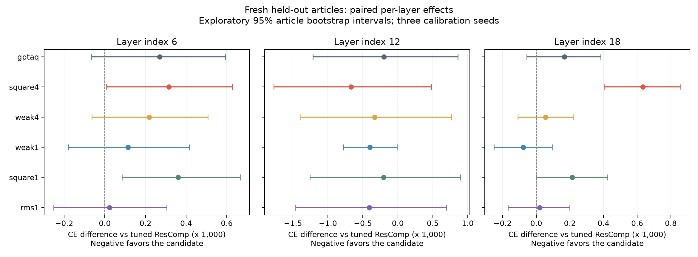
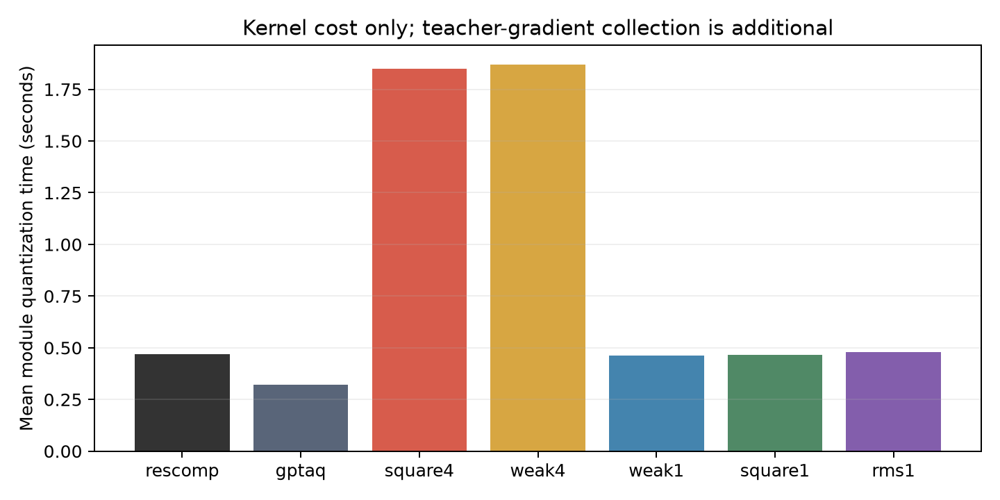

# 第三轮方法迭代及三轮研究总结

本轮问题：在公平调整补偿强度后，减弱任务权重、共享统计量或压缩极端梯度，能否带来额外收益？并且这种收益是否能跨目标层和校准样本复现？

完成日期：2026-09-26。234个扫描候选、63个新预留集候选均已运行完成，各轮原始结果、负结果和源码快照保留。

**结论：弱单组权重和RMS缓和了原四组强加权的一些退化，成本也低得多，但尚未证明跨层稳定优于调参ResComp。** 弱单组在9个层/seed组合中有6个更好；RMS相对同组数、同rho、同alpha的平方权重，三个层的平均CE都更低。两者相对ResComp的跨层平均改善很小，探索性区间都包含0。当前更合理的定位是“低成本候选与局部正向证据”，而不是“新方法已全面超过基线”。

## 1. 为什么需要第三轮

第一轮：固定 alpha=0.25 的教师梯度加权在一个目标模块上略优于普通 ResComp，三个校准 seed 的验证 PPL 平均从29.6203降到29.6029。

第二轮：双方同预算调 alpha 后都选择0.5。独立测试中普通 ResComp=27.1241，教师加权=27.1465；原先的小优势消失。前缀状态梯度没有超过基线，单组共享则明显节省内核成本。

所以第三轮不以“第一轮已经成功”为前提，而是检验三个具体解释：rho=0.5是否过强、平方是否放大了敏感度噪声、结论是否依赖目标层。我们保留普通 ResComp 和 GPTAQ 参考，并给每个方法族相同的 alpha 网格。

## 2. 本轮方法如何改进

设一组输出通道在 token t 上的梯度平方均值为

$$u_t=\operatorname{mean}_{i\in I_g}G_{it}^2.$$

先取 $v_t=u_t^p$，对 v 归一化到均值1、按上限10裁剪、再归一化，得到 $\widetilde v_t$，最终

$$s_t=(1-\rho)+\rho\widetilde v_t.$$

原方法 p=1。RMS方案 p=0.5，即对组内梯度平方均值开方。举例，两个token的u之比为100时，开方后之比为10，因此它旨在减弱极端值影响。它仍是代理度量，不是精确任务Hessian。

降低rho可理解为让统计量向普通重建收缩，因为加权统计量严格满足

$$H_s=(1-\rho)H_1+\rho H_{\widetilde v},\qquad C_s=(1-\rho)C_1+\rho C_{\widetilde v}.$$

这里H与C始终一致加权，固定原始重建目标W0@xf。rho=0退化为普通重建；并没有重新训练模型或修改预训练架构。

| 标识 | 方法 | 组数 | rho | p |
|---|---|---:|---:|---:|
| rescomp | 普通ResComp模块核心 | 1 | 0 | — |
| gptaq | GPTAQ神经元分解参考 | 1 | 0 | — |
| square4 | 原始四组平方权重 | 4 | 0.5 | 1 |
| weak4 | 减弱四组权重 | 4 | 0.1 | 1 |
| weak1 | 弱权重且共享一组 | 1 | 0.1 | 1 |
| square1 | 与RMS同组数、同rho的平方权重消融 | 1 | 0.25 | 1 |
| rms1 | 共享一组RMS权重 | 1 | 0.25 | 0.5 |

square1和rms1的配对比较用于区分RMS变换与rho变化；若只比较weak1与rms1，两者同时改变rho和p，无法归因。

## 3. 实验设计与可信度

- 模型：Qwen2.5-0.5B，固定revision `060db6499f32faf8b98477b0a26969ef7d8b9987`。4-bit权重假量化、FP32激活，CUDA，关闭TF32。
- 目标：`model.layers.{6,12,18}.self_attn.o_proj`，对应第7、13、19个block；分别采用其前面完整block的公共RTN前缀。
- 校准：seeds=0/1/2，每次64×256=16,384 tokens，是前两轮样本数的两倍。各方法在本轮内部使用相同数据；不能把跨轮差异全部归因于方法。
- 验证：仍使用官方validation中的64×256窗口，每次计分16,320 tokens；用于选参，已经反复使用，不是最终独立证据。
- 各方法族、各层分别在alpha={0.25,0.5,1.0}中按三个seed平均CE选一个值。固定rho/p/组数，不额外搜索。ResComp的alpha2仍固定0.25。
- 每次扫描26个量化候选，9次扫描共234个；额外测浮点和公共前缀。RMS在alpha=0.5有三次打乱对照，9次扫描共27个打乱候选，已包含在234中。
- 21个方法族/层选择的checkpoint哈希全部冻结后，才做新预留集评估；三个校准seed共63个评估候选。

### 新预留评估集，不是官方test

第二轮官方test已经被查看，按文章排除后只剩7个合格文章组、11段合格长文本，不足以支持本轮评估。因此本轮从官方train中从未参与此前及本轮校准的文章划出新holdout。

数据准备器识别顶层标题，排除136篇实际校准文章；固定seed=20260927，选择128篇未使用文章，每篇一个256-token窗口，共32,640个计分tokens。还排除了与校准/验证相同的完整文本和token窗口。文章、原始行号、文本/窗口哈希全部保存。

这是同数据域的新预留子集，不是官方test split，也不是新的外部语料。文章划分在实验前完成，但没有提前计算其模型损失。校准/验证/评估的身份核查不等于保证预训练模型从未见过这些公开文本。

### 统计解释

每个层都相对该层同前缀的调参ResComp做配对CE差值。先对同一文章的三个校准seed求平均，再按128篇文章bootstrap 5,000次；汇总跨层时先对同一文章的层间差值取平均，不把3层×3seed当9份独立数据。

区间是探索性的，条件于本模型、这三个校准样本和这三个目标，没有多重比较校正。方法族总搜索量比单个基线族大，挑选最好方法后的数字不是无偏优势估计。平均配对CE差不是全模型PPL。

## 4. 实际结果

### 4.1 验证集冻结了哪些设置

| 方法 | 层6 alpha | 层12 alpha | 层18 alpha |
|---|---:|---:|---:|
| rescomp | 0.25 | 1.0 | 1.0 |
| gptaq | 0.25 | 0.5 | 1.0 |
| square4 | 0.25 | 0.5 | 1.0 |
| weak4 | 0.25 | 0.5 | 1.0 |
| weak1 | 0.25 | 1.0 | 1.0 |
| square1 | 0.25 | 0.5 | 1.0 |
| rms1 | 0.25 | 0.5 | 1.0 |

这说明不能把第二轮某一层的alpha=0.5直接推广到所有层。层12/18的基线取到了搜索上界1.0，因而只能称为当前网格中的最好设置，未证明更大alpha或更细网格无益。

层12校准样本从32增加到64后，普通ResComp的验证选择从第二轮0.5变成了1.0。选择的不稳定性本身值得关注；不同轮次的数据规模也不同，不能把跨轮PPL变化全算成新方法的收益。

### 4.2 新预留集PPL：三个校准seed的平均

越低越好；表中不同列对应不同量化前缀，不能把三列直接合并为完整模型PPL。

| 方法 | 层6 | 层12 | 层18 |
|---|---:|---:|---:|
| 普通ResComp | **24.667591** | 28.144809 | 32.400822 |
| GPTAQ参考 | 24.674251 | 28.139133 | 32.406228 |
| 原四组平方权重 square4 | 24.675350 | **28.125943** | 32.421327 |
| 弱四组 weak4 | 24.672957 | 28.135423 | 32.402627 |
| **弱单组 weak1** | 24.670418 | 28.133523 | **32.398326** |
| 单组平方消融 square1 | 24.676485 | 28.139038 | 32.407727 |
| **RMS单组 rms1** | 24.668147 | 28.133273 | 32.401472 |

三个层没有一个统一赢家。早层普通ResComp最好；中间层原四组方案均值最好，但存在明显seed波动；后层弱单组均值最好，但差距很小。GPTAQ参考也并非各层都领先。

浮点模型在同一预留集上的PPL为18.869485。仅公共RTN前缀、目标模块仍浮点时，三层上下文PPL分别为24.680456、28.476821、32.478920。此前量化前缀造成的退化远大于这些方法间的小差异。

### 4.3 相对同层ResComp的CE差与不确定性

负数表示优于该层按验证集选出的ResComp。表中区间按前述128篇文章配对bootstrap计算，是探索性描述。

| 候选 | 层 | 平均ΔCE | 探索性95%区间 | 优于基线的seed数 |
|---|---:|---:|---|---:|
| weak1 | 6 | +0.000115 | [-0.000180, +0.000415] | 1/3 |
| weak1 | 12 | -0.000401 | [-0.000779, -0.000012] | **3/3** |
| weak1 | 18 | -0.000077 | [-0.000251, +0.000094] | 2/3 |
| rms1 | 6 | +0.000023 | [-0.000252, +0.000305] | 2/3 |
| rms1 | 12 | -0.000409 | [-0.001463, +0.000696] | 2/3 |
| rms1 | 18 | +0.000020 | [-0.000168, +0.000200] | 1/3 |

weak1在层12是本轮较值得保留的局部结果：它与普通ResComp都使用alpha=1.0、同样完整行批量，三个seed都更好，平均PPL下降约0.040%。但早层没有优势，因此不能写成跨层稳定改进。

RMS在早层有2个seed更好，却被第三个seed的退化抵消，平均仍略差。只报告胜出seed而不报告整体均值会误导。



横轴显示CE差乘1000，点在0左侧才有利于候选；各面板横轴范围不同，应看刻度而不是比较线段物理长度。

### 4.4 跨层平均配对差值

这里是三个不同单模块上下文的等权平均CE差值，不是全模型量化得分。

| 方法 | 平均ΔCE | 探索性95%区间 | 胜出层/seed组合 |
|---|---:|---|---:|
| gptaq | +0.000079 | [-0.000280, +0.000448] | 3/9 |
| square4 | +0.000093 | [-0.000281, +0.000492] | 3/9 |
| weak4 | -0.000020 | [-0.000393, +0.000372] | 4/9 |
| weak1 | -0.000121 | [-0.000287, +0.000047] | **6/9** |
| square1 | +0.000123 | [-0.000229, +0.000509] | 2/9 |
| rms1 | -0.000122 | [-0.000480, +0.000254] | 5/9 |

所有相对ResComp的跨层区间都包含0。weak1与rms1虽有小幅负均值，但目前无法排除抽样波动，也不能因为比较了多个候选后发现这两个均值较好，就将它们视为已确认优势。

## 5. 哪项方法修改得到了支持

### RMS相对平方权重的控制实验

在三个层中，rms1与square1都选中了相同alpha，组数同为1、rho同为0.25，区别只有重要性代理是否开方。

| 比较：rms1 − square1 | 平均ΔCE | 探索性95%区间 |
|---|---:|---|
| 层6 | -0.000338 | [-0.000586, -0.000098] |
| 层12 | -0.000205 | [-0.000520, +0.000108] |
| 层18 | -0.000193 | [-0.000400, +0.000005] |
| 三层等权平均 | **-0.000245** | **[-0.000385, -0.000106]** |

这提供了“缓和极端敏感度比直接平方更合适”的局部证据，但比较对象square1本身没有胜过ResComp。改善一个较差的加权变体，不等于改善强基线；区间也未进行多重比较校正。

### 减小rho不是所有层都有效

weak4与square4在每层具有相同alpha、同为4组、同为平方代理，只将rho从0.5减为0.1。对应层6/12/18的平均ΔCE分别为-0.000097、+0.000337、-0.000577。

减弱加权明显缓解后层的退化，却使中间层原本的均值收益变小。不能得出“rho越小越好”；更准确的是强度存在层依赖性。

### 打乱权重对照没有支持普遍的任务对齐收益

本轮固定在alpha=0.5比较rms1与三次随机打乱，每层3个校准seed，共9个配对：

| 层 | 对齐权重胜出次数 | 对齐平均CE − 打乱平均CE |
|---|---:|---:|
| 6 | 1/9 | +0.000466 |
| 12 | 5/9 | -0.000036 |
| 18 | 4/9 | -0.000026 |

早层在这个设置下反而更差，中后层只接近持平。这不支持“收益普遍来自正确的任务对齐”。早层/后层最终选择的alpha并非0.5，故这组对照也不能代替其最终设置下的机制检验。打乱对照只在验证集计算，本轮没有在预留集上追加探索。

## 6. 成本与实际完成量

| 方法 | 选中设置的平均模块量化时间 |
|---|---:|
| rescomp | 0.468秒 |
| gptaq参考 | 0.322秒 |
| square4 | 1.848秒 |
| weak4 | 1.869秒 |
| weak1 | **0.462秒** |
| square1 | 0.466秒 |
| rms1 | **0.480秒** |

weak1/rms1相对原四组版本约减少75%/74%的内核时间，接近普通ResComp。教师梯度采集仍需额外时间，三层平均约为4.10、3.58、3.23秒/校准seed；此开销不在表中。不能把内核加速说成整体流程加速4倍，更不能说成部署推理加速。



成功的9组扫描累计840.47秒，预留集评估274.29秒，合计约18.58分钟；不含准备、数值诊断、失败尝试、代码编写和图表生成。9组扫描共234个候选，预留集63个候选均完整结束。三个增量构建前缀在相同验证窗口上与独立扫描回归一致。

## 7. 三轮累计结论与下一步取舍

| 问题 | 当前回答 |
|---|---|
| 想法能不能落地 | 能。加权统计量、真实模型梯度采集、量化补偿、独立评估均已实现 |
| 第一轮的小收益是不是完全不存在 | 不是。它在某些固定设置和新文本上能复现，但调参和层变化会改变结论 |
| 当前能否宣称稳定超过ResComp | 不能。第三轮所有跨层均值区间都包含0，早层无平均优势 |
| 值得保留哪个低成本候选 | weak1与rms1。前者层12有3/3 seed局部收益；后者相对同配置平方代理更稳健 |
| 四组强加权是否值得继续作为默认 | 暂不。开销大，早/后层存在退化，没有统一优势 |
| 下一轮最需要改变什么 | 优先验证更合理的量化前缀和其他模块，而不是继续盲目加密rho网格 |

建议下一轮先用普通GPTQ/ResComp构造前缀，减少目前公共RTN造成的大幅输入漂移，再比较weak1、rms1和充分调参基线；另外加入一个不同类型的投影或MLP模块。层12/18的alpha位于搜索上界，也值得在新的开发协议里扩展检查。

从数学上，梯度平方/RMS都只衡量部分敏感度，忽略了误差方向、一阶项及跨通道/跨token相关项。本轮弱权重更安全、强权重不稳定的观察，与“代理可能不够准确”相容，但实验没有单独证明是哪一种近似导致失败。

本轮仍只覆盖一个0.5B模型、一个位宽、三处注意力输出投影、同一数据域和单模块量化。新预留集现在也已查看，后续若据此改方法，不能继续把它称为未见的最终测试。下一轮应预先冻结新的评估数据或外部语料；全面算法优势还需要完整模型和更广泛评估。

## 8. 完整结果文件

- [逐层机器汇总](../results/round3_summary.json)；[CSV表格](../results/round3_summary.csv)。包含全部逐seed PPL、CE差、区间、成本和控制实验数值。
- [冻结设置与权重哈希](../results/round3_holdout/selection.json)；[全部预留集逐窗口损失](../results/round3_holdout/metrics.json)；[预留文章身份](../results/round3_holdout/manifest.json)。
- 图表除PNG外另有 [效果图SVG](figures/round3_effects.svg)，可直接用于汇报排版。

## 数值问题与处理记录

在layer12/seed2的退化检查中，分组rho=0结果与未分组基线有206/802,816个权重不同，约0.0257%。实验因此中止，没有跳过错误继续计算候选。

独立诊断确认所有token权重均为1，H和C逐位相同。最早分歧发生于第267列：完整行批量的舍入前网格值为-1.4999998807907104，分组行批量为-1.5，仅差1.192×10⁻⁷。FP32矩阵更新的微小差异跨过半整数舍入边界，后续逐列补偿又可能传播这种差异。因此理论行可分不等于不同GPU行批量下的量化码必须逐位一致。

处理方式：rho=0时明确调用未分组的普通核心，保证端点完全一致，同时避免重复分组计算。没有放宽容差，也没有改动本轮rho>0候选的运算路径。与快照中的旧实现比较，5种权重设置×是否打乱的10个非零rho对照输出逐位相同，15项核心/数学/选择检查再次通过。

前5组成功扫描与后4组使用了两个quant_core源码哈希，差异仅为上述零权重端点处理；run_pilot源码一致。两个版本均保存，评估脚本只接受这两个明确记录的哈希。失败产物另存，未覆盖为成功结果。这个修复不被计为方法精度提升。

证据：[舍入诊断](../results/round3_null_diagnosis.json)、[非零权重兼容检查](../results/round3_endpoint_regression.json)、[源码快照清单](../results/round3_source/source_manifest.json)。

## 复现与产物索引

- 第一轮：[固定超参数单模块报告](20260926_report.md)。第二轮：[公平调参及官方test评估](20260926_round2_report.md)。第三轮：[事前协议](round3_protocol.md)。
- 数据划分：`prepare_round3_holdout.py`；数据身份为 `data/round3_holdout/manifest.json`，原始模型权重和数据缓存沿用前两轮。
- 实验执行：`run_pilot.py --iterate`；完整命令保存于 `run_round3.ps1`。在 `C:\GPTQ\Experiment` 运行；该脚本会拒绝覆盖已有成功产物，重跑请先使用新的批次目录。
- 选择及评估：`evaluate_iteration.py`；读取三个层、三个seed的扫描结果，冻结全部设置及checkpoint哈希后才评估新文章。每个层的量化前缀还在相同验证窗口上与独立扫描做回归检查。
- 原始扫描：`results/round3_l{6,12,18}_s{0,1,2}/`，包括config、diagnostics、metrics、各候选目标模块的`.pt`；这些不是完整压缩模型。
- 冻结设置与预留集指标：`results/round3_holdout/`；控制台日志：`results/round3_logs/`。
- 源码：`results/round3_source/`，两个兼容quant_core版本均保存，清单包含SHA256。
- 结果重算：`python results/summarize_round3.py`；图表重算：`python results/plot_round3.py`。统计脚本先验证完整结束标记，不将部分产物当作成功。

方法正确性检查命令：

```powershell
python -m unittest test_quant_core verify_weighted_math test_refinement test_iteration -v
```

所有位宽均为假量化：权重仍存储为浮点值，只被限制在4-bit网格上。此次没有产生打包int4推理checkpoint，也没有测量部署加速比。
