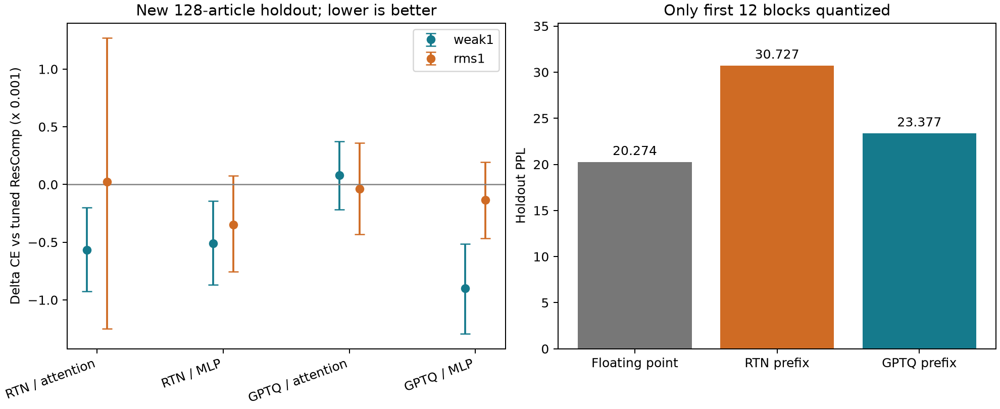

# 第四轮迭代实验报告与四轮投入判断

完成日期：2026-09-27；扫描于 9 月 26 日完成。数字由保存的逐窗口结果自动汇总；阅读顺序是先看结论，再看跨模块结果和限制。

## 1. 结论先说清楚

当前“平方/RMS 梯度 token 加权 + ResComp”的具体路线未达到本轮预设继续投入门槛。不建议再按同一形式扩大参数扫描；保留任务敏感度这个研究问题，但应先更换或验证误差度量。

**想法能否实现：能。** 加权 H/C、固定浮点目标和量化补偿已经实现并在真实 Qwen 模型上运行。
**是否已经证明这个具体加权方法有价值：必须看它能否超过调好参数的基线，以及更简单的目标 GPTQ。** “能运行”“某个配置稍好”和“稳定值得增加复杂度”是三个不同结论。

本轮并非完全没有正信号：weak1 在 RTN 前缀的两类模块上都赢了 3/3 seed，相对 ResComp 的 PPL 分别改善约 0.0566% 和 0.0512%，探索性文章区间均未跨零。这个局部信号应保留，不能说“加权完全无效”。但换成更好的 GPTQ 前缀，注意力模块平均略退步；MLP 虽相对 ResComp 改善约 0.0897%，相对目标 GPTQ/GPTAQ 却只剩约 0.0023%。因此当前主要障碍是额外收益很小且依赖基线与模块，不只是没达到某个任意阈值。

本轮最明确的系统改进来自校准量化前缀。它属于更强基线的贡献，不能算成任务加权的新贡献。下表均在同一批新预留文章上评估，且这里仅前 12 个块量化，目标模块保持浮点：

| 模型状态 | 三 seed 平均 PPL，越低越好 |
|---|---:|
| 原始浮点 | 20.273703 |
| RTN 前缀 | 30.727183 |
| 校准 GPTQ 前缀 | 23.376929 |

校准 GPTQ 前缀相对 RTN 的配对几何平均 PPL 变化为 **-23.922%**。这不是全模型 W4 的 PPL，也不表示任务加权获得了这个改善。

## 2. 这次跑了多少、怎样避免偏向新方法

本轮完成 **12 组扫描、216 个目标候选评估**：2 种前缀 × 2 种模块 × 3 个校准 seed，每组 18 个候选。四个方法族都扫描 alpha=0.25/0.5/1/1.5，另加目标 RTN/GPTQ 参考。其中 42 个候选与第三轮设置相同，作为复现对照；216 是本轮执行数，不是 216 个从未试过的独立假设。

之后冻结全部 16 个方法族设置及权重哈希，在 **128 篇新文章上评估 72 个目标配置**（四个选参方法族加两个固定参考），另有浮点及六个前缀参照。每个候选计分 32,640 个 token。三个 seed 共享文章，不能将其当成 384 篇独立文章。

校准与开发验证都为 64×256 窗口，模型是 Qwen2.5-0.5B；运算 F32，权重 W4 假量化。新预留文章来自 WikiText2 train split，排除了 136 篇实际校准文章、第三轮 128 篇文章，且与第二轮已用 test 文本/窗口无精确哈希交集。它不是官方 test，不是新领域。

全部选择在新预留 CE 计算前写入 `results/round4_holdout/selection.json`。前缀重载后的验证 CE 必须与每次原扫描相差小于 1e-6；所有 12 次对照通过。

预先设置的继续门槛是：在 GPTQ 前缀的两类模块上都改善，各至少赢 2/3 seed，平均相对 PPL 改善至少 0.1%，文章配对区间方向也支持改善。该阈值用于本项目控制投入，不是普遍统计标准。协议见 [round4_protocol.md](round4_protocol.md)。

## 3. 新预留集的完整主结果

以下是三 seed 的 PPL 算术平均。注意力与 MLP 是两个独立单目标实验，不能相加或合成整模型 PPL。

| 上下文 | 目标 RTN | 目标 GPTQ | ResComp | GPTAQ | weak1 | rms1 |
|---|---:|---:|---:|---:|---:|---:|
| RTN 前缀 / 注意力输出 | 30.786551 | 30.752588 | 30.346261 | 30.351416 | 30.329057 | 30.346935 |
| RTN 前缀 / MLP up | 30.654657 | 30.782156 | 30.921062 | 30.987729 | 30.905230 | 30.910357 |
| GPTQ 前缀 / 注意力输出 | 23.436846 | 23.390741 | 23.376511 | 23.372482 | 23.378382 | 23.375717 |
| GPTQ 前缀 / MLP up | 23.423746 | 23.418209 | 23.438669 | 23.418205 | 23.417661 | 23.435568 |

验证集选出的 alpha：

| 上下文 | ResComp | GPTAQ | weak1 | rms1 |
|---|---:|---:|---:|---:|
| RTN 前缀 / 注意力输出 | 1 | 0.5 | 1 | 0.5 |
| RTN 前缀 / MLP up | 0.25 | 0.25 | 0.25 | 0.25 |
| GPTQ 前缀 / 注意力输出 | 0.5 | 0.5 | 0.5 | 0.25 |
| GPTQ 前缀 / MLP up | 0.5 | 0.25 | 0.25 | 0.5 |

选择出现在搜索边界时，只能称为“已试网格中的最佳”，不能称为全局调优最优。尤其新 MLP 模块的合适补偿范围可能不同，因此两个固定参考不能省略。

## 4. 加权到底改善了多少，是否稳定

ΔCE=加权−同上下文已选参 ResComp，负数为改善。相对 PPL=100×[exp(平均配对 ΔCE)−1]。区间是先平均 seed、再按文章配对抽样 10,000 次得到的探索性 95% 区间，未作多重比较校正。

| 上下文 | 方法 | ΔCE | 95% 区间 | 相对 PPL | 赢的 seed |
|---|---|---:|---|---:|---:|
| RTN 前缀 / 注意力输出 | weak1 | -0.0005660 | [-0.0009244, -0.0002002] | -0.0566% | 3/3 |
| RTN 前缀 / 注意力输出 | rms1 | +0.0000254 | [-0.0012485, +0.0012713] | +0.0025% | 2/3 |
| RTN 前缀 / MLP up | weak1 | -0.0005121 | [-0.0008697, -0.0001434] | -0.0512% | 3/3 |
| RTN 前缀 / MLP up | rms1 | -0.0003462 | [-0.0007570, +0.0000770] | -0.0346% | 3/3 |
| GPTQ 前缀 / 注意力输出 | weak1 | +0.0000798 | [-0.0002183, +0.0003748] | +0.0080% | 2/3 |
| GPTQ 前缀 / 注意力输出 | rms1 | -0.0000357 | [-0.0004324, +0.0003600] | -0.0036% | 1/3 |
| GPTQ 前缀 / MLP up | weak1 | -0.0008973 | [-0.0012948, -0.0005141] | -0.0897% | 3/3 |
| GPTQ 前缀 / MLP up | rms1 | -0.0001329 | [-0.0004653, +0.0001932] | -0.0133% | 2/3 |

还要与更简单的目标 GPTQ 对照。以下只看本轮重点的校准 GPTQ 前缀，负数仍表示该方法较好：

| 目标模块 | 方法 | 相对目标 GPTQ 的 ΔCE | 相对 PPL |
|---|---|---:|---:|
| GPTQ 前缀 / 注意力输出 | ResComp | -0.0006079 | -0.0608% |
| GPTQ 前缀 / 注意力输出 | GPTAQ 参考 | -0.0007812 | -0.0781% |
| GPTQ 前缀 / 注意力输出 | weak1 | -0.0005281 | -0.0528% |
| GPTQ 前缀 / 注意力输出 | rms1 | -0.0006436 | -0.0643% |
| GPTQ 前缀 / MLP up | ResComp | +0.0008742 | +0.0875% |
| GPTQ 前缀 / MLP up | GPTAQ 参考 | -0.0000000 | -0.0000% |
| GPTQ 前缀 / MLP up | weak1 | -0.0000231 | -0.0023% |
| GPTQ 前缀 / MLP up | rms1 | +0.0007413 | +0.0742% |

GPTQ 前缀 / MLP 中，weak1 相对目标 GPTQ 的 ΔCE 95% 区间为 [-0.0005339, +0.0004835]，跨过零，且只赢 1/3 seed。它在表格中的最佳平均 PPL 不足以证明超过这个更简单的对照。



继续门槛逐项核对：

| 方法 | 模块 | 均值改善 | 至少赢 2/3 | 至少改善 0.1% | 区间上界小于零 |
|---|---|---|---|---|---|
| weak1 | attn | 否 | 是 | 否 | 否 |
| weak1 | mlp | 是 | 是 | 否 | 是 |
| rms1 | attn | 是 | 否 | 否 | 否 |
| rms1 | mlp | 是 | 是 | 否 | 否 |

此门槛是相对 ResComp 的筛选；即使通过，也必须再检查上表中的 GPTAQ/GPTQ 参考，不能忽略更简单且成绩更好的对照。

开发数据还可检查“局部重建指标最低”是否选中了“任务 CE 最低”的同一候选。以下在 16 个补偿族候选内，分别按三个 seed 的指标均值选择，仅用于解释，不参与预留集选参：

| 上下文 | 校准普通 MSE 最低候选 | 验证输出 MSE 最低候选 | 验证 CE 最低候选 |
|---|---|---|---|
| RTN 前缀 / 注意力输出 | rescomp_a1 | gptaq_a0.5 | weak1_a1 |
| RTN 前缀 / MLP up | rescomp_a1 | rescomp_a1 | weak1_a0.25 |
| GPTQ 前缀 / 注意力输出 | gptaq_a1 | gptaq_a0.5 | gptaq_a0.5 |
| GPTQ 前缀 / MLP up | gptaq_a1 | gptaq_a0.5 | gptaq_a0.25 |

候选不一致说明局部误差与最终任务的优化目标存在偏差，不能单凭重建误差下降宣布成功。它不单独证明某个替代代理一定更好。

## 5. 成本和输入漂移

| 上下文 | 相对输入漂移 | 教师梯度收集/秒 | ResComp 核心/秒 | weak1 核心/秒 | rms1 核心/秒 |
|---|---:|---:|---:|---:|---:|
| RTN 前缀 / 注意力输出 | 0.843611 | 3.589 | 0.456 | 0.470 | 0.458 |
| RTN 前缀 / MLP up | 0.605547 | 3.851 | 0.493 | 0.506 | 0.460 |
| GPTQ 前缀 / 注意力输出 | 0.466353 | 3.646 | 0.492 | 0.483 | 0.508 |
| GPTQ 前缀 / MLP up | 0.348466 | 4.232 | 0.477 | 0.712 | 0.495 |

三个 GPTQ 前缀构建计时合计 81.7 秒；12 次成功扫描内部计时合计 927.0 秒；最终新预留评估 337.9 秒。以上合计约 **22.44 分钟**，不包含代码编写、失败诊断、数据准备及部分模型加载/文件哈希时间，不是整个会话墙钟时间。

单组加权避免了早期四组的重复求解成本，但仍需额外收集教师梯度。表中核心耗时不等于整个量化流程，也不能推出 int4 推理加速。

## 6. 四轮证据怎样合起来看

| 阶段 | 真正回答的问题 | 已得到的证据 |
|---|---|---|
| 第一轮 | 实现能否运行 | 能；原设置上有约 0.06% 的局部改善，幅度很小，打乱权重也出现部分改善 |
| 第二轮 | 是否只是基线未调好 | 同样调整 alpha 后，加权没有超过普通基线；换成当前前缀梯度也未解决 |
| 第三轮 | 弱化/RMS/单组能否跨深度泛化 | 单组降低核心计算成本；跨三个深度的平均加权收益区间仍跨零；RMS 比较差的平方代理好，不等于超过基线 |
| 第四轮 | 更好前缀和不同模块是否改变结论 | 见本报告新预留表格与继续门槛；前缀质量确实显著改善，任务加权额外收益须单独判断 |

每轮评估集与部分设置不同，不能把各轮绝对 PPL 连成“越来越好”的曲线。这里只合并研究结论，所有数值胜负都在各自同一数据、同一前缀、同一模块内比较。

## 7. 我的建议：哪些继续，哪些停止

当前“平方/RMS 梯度 token 加权 + ResComp”的具体路线未达到本轮预设继续投入门槛。不建议再按同一形式扩大参数扫描；保留任务敏感度这个研究问题，但应先更换或验证误差度量。

1. **继续做更扎实的基线和误差定位。** 本轮校准前缀已有清楚的收益，但它是部分前缀结果。若目标是得到更好的实际量化模型，应先完成匹配网格、校准预算和评估协议的全模型 GPTQ/ResComp 基线，再评估追加方法的边际收益。
2. **停止无目的扩大同一种 rho/分组/alpha 扫描。** 这已经不是“完全没调参”的状态；多花算力找到某个最好看的配置，不能回答是否跨模块泛化。
3. **若保留研究方向，下一步先检查任务度量。** 对固定候选输出误差，比较普通 MSE、当前梯度代理与保留误差符号/少量方向信息的候选代理，看它们能否在独立开发数据上正确排序真实 CE 或教师 KL。只有预测能力改善，才值得把它加入量化求解器。
   对 MLP 优先检验一个具体问题：up 输出要与 silu(gate) 相乘，单独让 up 恢复教师值不一定改善两路乘积。可先把比较位置移到合流后的输出或整个 MLP 输出，验证联合重建目标；当前结果没有证明这项改法一定获益。
4. **不要把简单增加复杂度当作优化。** 低秩曲率、方向分组、教师 KL 等都是待检验的新假设，不是本报告已经证明有效的方法。先做小规模代理诊断，再决定是否扩展整模型、多数据集和更大模型。

真实任务变化包含 gᵀe 和二阶项；平方梯度加权忽略符号与交叉方向，单组又平均掉通道差异。这是当前代理可能失效的原因之一，不是已经被这组实验唯一确定的因果解释。详细数学例子见技术附件。

如果当前目标是学习与研究训练，这些实验仍值得保留：你已经建立了从公式、核查、对照到独立评估的完整链条。如果目标是尽快形成有竞争力的论文主线，现有证据尚不足以把当前加权近似当作已成立的贡献。

## 8. 核查、限制与如何复跑

16 项数学/实现检查通过。MLP 首次运行曾因梯度分位数诊断超出 PyTorch 元素上限而停止，修复只抽样日志诊断，所有拟合仍用全量数据。最终评估首次又在前缀检查处停止：CPU 重建 RTN 与扫描的 CUDA 路径格点不一致。已统一为 CUDA，精确复现原 CE；原冻结选择与权重哈希全部保持，未放宽阈值。两次失败记录和源码版本均保留，详细数值见 [技术附件](round4_methods_and_interpretation.md)。

关键限制：单个 0.5B 模型、单个文本数据集、固定两类目标模块、仅 3 个校准 seed、重复使用开发验证集、探索性区间、W4/F32 假量化、非官方全模型复现。没有声称 W4A16 部署、推理加速、全模型加权收益或文献新颖性。较低 alpha 边界与量化网格选择也限制了结论范围。

主要文件：

- 预先协议：[round4_protocol.md](round4_protocol.md)。
- 技术解释：[round4_methods_and_interpretation.md](round4_methods_and_interpretation.md)。
- 机器汇总：[round4_summary.json](../results/round4_summary.json)、[CSV](../results/round4_summary.csv)。
- 冻结选择：[selection.json](../results/round4_holdout/selection.json)。
- 逐文章指标：[metrics.json](../results/round4_holdout/metrics.json)。
- 数据身份：[manifest.json](../data/round4_holdout/manifest.json)。
- 源码版本：[source_manifest.json](../results/round4_source/source_manifest.json)。

在 Experiment 目录重新生成汇总、图与报告：

```powershell
python results/summarize_round4.py
python results/write_round4_report.py
```

重新跑模型使用 `run_round4.ps1`，但已完成结果会跳过、未完成目录会拒绝覆盖。完整从零复跑应在独立实验目录保留本轮源码快照和数据清单，并使用新的结果路径；不要覆盖现有原始记录。准备新预留集的脚本也拒绝覆盖旧集。
