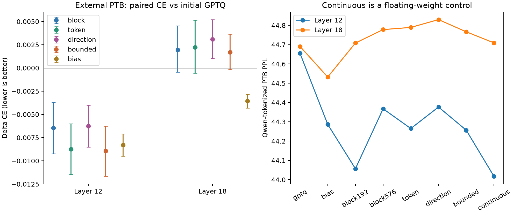

# 第六轮最终报告：任务敏感度改进、完整块迁移及六轮累计结论

完成日期：2026-09-27。本报告先给出本轮全部新实验和判断，后附前五轮完整报告。所有结果来自本机实际运行；没有用外部测试成绩重新选参。

## 1. 本轮结论

未加权完整块的外部迁移表现不满足两个目标层都稳定改善的检查；应保留分层结果，不能写成普遍有效。

本轮token加权、原方向罚项及限制曲率的方向版本均未通过两层共同的额外收益门槛。当前没有证据支持把新增敏感度复杂度设为默认。

PPL是困惑度，衡量下一词预测，越低越好。这里所有胜负都在相同数据、前缀和目标层内比较；不能拿第五轮WikiText的绝对PPL与本轮PTB数值相减来衡量进步。用白话说，完整块目标让主分支和残差旁路相加后的整体输出接近浮点教师；新敏感度方法则尝试把这个整体误差中更影响任务的部分看得更重。

原始研究问题仍是：任务敏感度能否改善量化补偿。本轮把敏感度施加到已验证更合理的完整块误差，而不是回到早期单分支目标。同时加入更多优化步数、另一个目标层、外部语料、896参数均值修正及连续权重对照，区分目标选择、计算预算与参数自由度。

## 2. 已执行的全部改进

| 方案 | 改动 | 回答的问题 |
|---|---|---|
| block192 / block576 | 未加权完整块，192与576步 | 原方案能否迁移；三倍步数是否值得 |
| token192 / token576 | 以完整块教师梯度平方产生弱token权重 | 原任务加权想法在正确目标上能否恢复价值 |
| direction192 / direction576 | 完整块MSE加一个梯度方向投影误差 | 保留通道间梯度符号关系是否优于仅看幅度 |
| bounded192 / bounded576 | 方向项缩放为9/d，误差空间曲率比限制为10 | 原方向方案是否因过度放大单方向而失效 |
| continuous192 / continuous576 | 同初始化/范围/优化器，去掉round | 固定离散网格是否限制修复，不作为4-bit结果 |
| gptq | 初始量化up参考 | 不做额外修复的起点 |
| bias | 保持GPTQ权重，仅加校准块误差均值 | 896个额外浮点参数是否已经足够 |

原计划每上下文10个候选，2层×3seed，共60个；开发阶段另追加12个bounded检查点，总72个。五个优化族分别按三个seed平均开发CE选192或576，再加gptq、bias及固定block192/block576锚点。外部共有48个不重复候选条件、6个重复别名；另有浮点和6个前缀参照。与前五轮累计共864次扫描候选执行、258次冻结后的候选评估，执行数包含跨轮重叠，不是独立假设数。

## 3. 方法、数学和公平比较

Qwen2.5-0.5B固定revision 060db6499f32faf8b98477b0a26969ef7d8b9987，CUDA/F32、TF32关闭。权重量化范围[-8,7]，每行scale固定为原权重absmax/7。校准每seed64×256，seed=0/1/2；开发64×256。Adam代码空间学习率固定.03、64-token微批次×4累积，所有方法共用完全相同的随机token批次。

随机token有放回抽样；192/576步分别使用49152/147456次token，约为原校准token量的3/9倍，是重复使用同一校准集而非新增训练数据。因此更长优化可能继续降低校准误差，也可能损害泛化。

目标为零起算层12或18的mlp.up_proj。两者均使用已保存的前12块GPTQ前缀；层18之前的12–17块保持浮点。它验证同一来源的前缀误差能否在不同位置修复，不是“前18块GPTQ”实验。目标层gate/down和后续块不变，各目标独立运行，不把两个层的收益相加。

令Bf=原始浮点块输出，Rq=当前前缀下MLP前残差，e_t=Mq(Q)_t−(Bf−Rq)_t。未加权目标L0=mean(e²)。完整块梯度G由原始浮点模型下一词CE对Bf求得；只用校准文本，未使用PTB标签训练。

token方案：u_t=mean_i(G_it²)，归一化、clip=10、再归一化得到v_t，s_t=.9+.1v_t；损失mean(s·e²)。direction方案：d_t=G_t/max(||G_t||,1e−12)，损失L0+mean_t[(d_tᵀe_t)²]。方向罚项系数固定1；零梯度方向为零。所有目标除以mean((Bf−Rq)²)，保持相同归一化基准。

方向项展开后含跨通道乘积，保留通道相对符号，但平方后不保留整体梯度方向的一阶增减效应。它不是完整Hessian或严格任务损失，不含跨token项；不同目标仍可能有不同的优化难度。原direction系数固定1，追加bounded系数固定9/d，未进行连续系数网格搜索。若失败，结论限制于已试构造，不能否定所有方向敏感度方法。

在第一组开发结果中原direction较差，数学核查发现每token误差空间Hessian为2I/d+2uuᵀ，非零单位方向下特征值比d+1=897。因此在外部测试前追加bounded：方向项乘9/d，将这一比值固定为10。它不等于权重空间或真实任务Hessian的条件数。追加版本保持所有训练预算一致，协议和源码修订均保留；属于基于开发结果的自适应迭代，不能声称最初就预注册。

continuous从相同GPTQ代码初始化，去掉round并裁剪到相同连续范围；它是受限连续权重修复，不保证达到浮点最优。bias为校准误差均值，增加了一个块输出偏置，因此与纯权重方法架构不同、预算也不同。二者只作归因与成本对照。

## 4. 新外部语料与测试隔离

数据来自[PTB公开源文件](https://raw.githubusercontent.com/wojzaremba/lstm/76870253cfca069477f06b7056af87f98490b6eb/data/ptb.test.txt)，仓库commit `76870253cfca069477f06b7056af87f98490b6eb`，字节SHA256 `dd65dff31e70846b2a6030a87482edcd5d199130cdcfa1f3dccbb033728deee0`。它是预处理的PTB文本，包含原有大小写/未知词等处理；没有将本轮PPL与词级PTB论文成绩比较。

按原文本换行、Qwen分词、不添加特殊EOS，划分非重叠256token窗口。四个相邻窗口组成一个1024token块，固定seed=20261001从完整块中选32块，共128窗口、每候选32640计分token。数据准备阶段不计算模型损失，选参仅用原WikiText开发集。

已检查与历史校准、开发及已用测试的精确窗口哈希无交集；这不保证没有语义重复，也不保证预训练模型未见过公开语料。所有层/方法选择、源码与权重哈希在PTB评估前一起冻结。前一轮73篇WikiText文章没有被重新当作新测试。

区间计算先平均同窗口三个seed的CE差，再平均每组四窗口，对32个连续块配对bootstrap10000次。块不是独立文章，跨块仍可能相关；因此区间是探索性、条件于当前校准seed的证据，未做多重比较校正。不能把128×3或32640token当作独立样本量。

## 5. 外部测试完整结果

浮点模型在本轮PTB窗口上的PPL=36.788430。以下为三个seed PPL的算术平均；相对变化另由配对平均ΔCE计算。两个目标层是独立条件。

| 层 | 方法 | 开发选定配置/固定锚点 | 开发PPL | 外部PPL | 相对GPTQ变化 | 相对所选block变化 |
|---|---|---|---:|---:|---:|---:|
| 12 | block | block_s576 | 22.539110 | 44.367550 | -0.6437% | +0.0000% |
| 12 | token | token_s576 | 22.533332 | 44.265341 | -0.8712% | -0.2290% |
| 12 | direction | direction_s576 | 22.979518 | 44.376714 | -0.6246% | +0.0192% |
| 12 | continuous | continuous_s576 | 22.432169 | 44.017776 | -1.4256% | -0.7869% |
| 12 | bounded | bounded_s576 | 22.549277 | 44.256792 | -0.8901% | -0.2480% |
| 12 | gptq | gptq | 23.007756 | 44.654829 | +0.0000% | +0.6479% |
| 12 | bias | bias | 22.931227 | 44.286800 | -0.8259% | -0.1833% |
| 12 | block192 | block_s192 | 22.541263 | 44.057048 | -1.3400% | -0.7007% |
| 12 | block576 | block_s576 | 22.539110 | 44.367550 | -0.6437% | +0.0000% |
| 18 | block | block_s576 | 22.822123 | 44.778061 | +0.1960% | +0.0000% |
| 18 | token | token_s576 | 22.821776 | 44.789314 | +0.2215% | +0.0255% |
| 18 | direction | direction_s576 | 23.014622 | 44.829859 | +0.3085% | +0.1122% |
| 18 | continuous | continuous_s576 | 22.764111 | 44.709336 | +0.0420% | -0.1538% |
| 18 | bounded | bounded_s192 | 22.876638 | 44.766637 | +0.1689% | -0.0271% |
| 18 | gptq | gptq | 22.971680 | 44.690786 | +0.0000% | -0.1956% |
| 18 | bias | bias | 22.966352 | 44.532135 | -0.3557% | -0.5507% |
| 18 | block192 | block_s192 | 22.832657 | 44.708507 | +0.0390% | -0.1567% |
| 18 | block576 | block_s576 | 22.822123 | 44.778061 | +0.1960% | +0.0000% |

新敏感度目标与开发所选未加权block直接比较：

| 层 | 方法 | ΔCE | 95%块区间 | 赢的seed | 改善的窗口块 |
|---|---|---:|---|---:|---:|
| 12 | token | -0.0022922 | [-0.0033347, -0.0012922] | 2/3 | 26/32 |
| 12 | direction | +0.0001924 | [-0.0020726, +0.0023682] | 1/3 | 12/32 |
| 12 | bounded | -0.0024831 | [-0.0033936, -0.0015842] | 1/3 | 27/32 |
| 18 | token | +0.0002548 | [-0.0004166, +0.0009189] | 2/3 | 16/32 |
| 18 | direction | +0.0011218 | [-0.0006198, +0.0029671] | 2/3 | 16/32 |
| 18 | bounded | -0.0002707 | [-0.0012884, +0.0007585] | 2/3 | 18/32 |



敏感度与未加权方案也需匹配所选步数，避免把预算差异算成任务信息的收益：

| 层 | 方法 | 相同步数 | 相对同预算block的PPL变化 | 95%块区间（ΔCE） |
|---|---|---:|---:|---|
| 12 | token | 576 | -0.2290% | [-0.0033347, -0.0012922] |
| 12 | direction | 576 | +0.0192% | [-0.0020726, +0.0023682] |
| 12 | bounded | 576 | -0.2480% | [-0.0033936, -0.0015842] |
| 18 | token | 576 | +0.0255% | [-0.0004166, +0.0009189] |
| 18 | direction | 576 | +0.1122% | [-0.0006198, +0.0029671] |
| 18 | bounded | 192 | +0.1298% | [+0.0008601, +0.0017258] |

## 6. 三倍优化步数、均值修正及连续权重对照

| 层 | 比较 | ΔCE | 相对PPL | 95%块区间 | 赢的seed |
|---|---|---:|---:|---|---:|
| 12 | 576步 − 192步 | +0.0070320 | +0.7057% | [+0.0056839, +0.0083765] | 0/3 |
| 12 | 均值修正 − 初始GPTQ | -0.0082929 | -0.8259% | [-0.0094862, -0.0070886] | 3/3 |
| 12 | 连续权重 − 所选W4 block | -0.0079004 | -0.7869% | [-0.0088223, -0.0069508] | 3/3 |
| 12 | 所选W4 block − 初始GPTQ | -0.0064582 | -0.6437% | [-0.0092409, -0.0037086] | 3/3 |
| 18 | 576步 − 192步 | +0.0015682 | +0.1569% | [+0.0004029, +0.0027014] | 1/3 |
| 18 | 均值修正 − 初始GPTQ | -0.0035638 | -0.3557% | [-0.0043162, -0.0028301] | 3/3 |
| 18 | 连续权重 − 所选W4 block | -0.0015388 | -0.1538% | [-0.0020388, -0.0010552] | 2/3 |
| 18 | 所选W4 block − 初始GPTQ | +0.0019582 | +0.1960% | [-0.0004430, +0.0045308] | 1/3 |

延长步数只改优化预算，不能把它的收益归于敏感度。连续权重如果更好，只说明该训练路径下存在离散网格代价；如果未更好，也不证明离散解超过浮点最优。均值修正若能取得部分收益，说明低频/均值漂移值得关注，但不等于解释完整块方案的全部收益。

## 7. 是否继续投入及具体优化方向

本轮token加权、原方向罚项及限制曲率的方向版本均未通过两层共同的额外收益门槛。当前没有证据支持把新增敏感度复杂度设为默认。

未加权完整块的外部迁移表现不满足两个目标层都稳定改善的检查；应保留分层结果，不能写成普遍有效。

| 新方案 | 层 | 至少赢2/3seed | 改善至少0.1% | 区间上界<0 |
|---|---|---|---|---|
| token | 12 | 是 | 是 | 是 |
| token | 18 | 是 | 否 | 否 |
| direction | 12 | 否 | 否 | 否 |
| direction | 18 | 是 | 否 | 否 |
| bounded | 12 | 否 | 是 | 是 |
| bounded | 18 | 是 | 否 | 否 |

本轮需要特别注意三个结论。第一，第12层token相对开发选出的576步block改善约0.229%，但固定192步block在同一外部集上的PPL为44.0570，优于token576的44.2653；因此不能把这个局部胜出解释为全面超过旧方案。第二，bounded在第12层的平均差和连续窗口块区间虽支持改善，相对block却只赢1/3校准seed，收益主要集中在一个seed。第三，第18层未加权block和敏感度方案均未稳定超过初始GPTQ，简单bias却在三个seed都改善。

延长到576步在两个目标层的PTB上都比192步更差，而开发规则仍选中了576步。这是单一开发语料选参的迁移局限，并非可以据外部结果事后改写选择。第六轮据此提供了第七轮“限制权重变化、分离均值漂移、使用两个已见开发域选择”的动机；第六轮测试一旦参与此改进，就不再是第七轮独立证据。

0.1%是控制研究投入的实用筛选线，不是统计定律；优先结合幅度、种子一致性、语料迁移和计算代价判断。未通过门槛的方案不继续在这份PTB测试上追加参数搜索。

下一步优先级：先保留本轮跨条件更可靠的简单目标，再考虑两个目标模块的顺序联合修复，检查收益是否抵消；随后扩展完整模型W4和另一模型规模。任何任务加权改进都应超过相同预算的未加权block，而不是只超过原始GPTQ。方向项若保留，应先在新开发语料检查它与真实CE变化是否一致，再考虑系数收缩；本轮没有证明应直接增加更复杂的曲率。

当前仍缺少打乱token权重/随机方向对照，不能把某个小增益唯一归因为任务信息；新层未重新扫描全部ResComp/GPTAQ族，因此也不能声称超过所有量化方法。本轮没有完成gate/up/down联合量化、完整模型部署或论文查新。若目标是论文主线，应把现阶段定位为误差目标与泛化的实证研究，而不是已经建立全模型新算法优势。

## 8. 资源安全、成本和验证

继续执行4 GiB分配器预算、8 GiB整卡停止阈值、78℃停止、4 GiB系统RAM余量，启动需至少5 GiB空闲显存。缓存CPU驻留、单GPU进程顺序执行、64×4微批次、每步/序列40ms间歇；没有提高限额。

| 指标 | 本轮实测 |
|---|---:|
| PyTorch峰值分配 | 2.546 GiB |
| PyTorch峰值保留 | 2.992 GiB |
| 整卡采样最大已用显存 | 4875 MiB |
| 采样最高温度 | 69℃ |
| 采样最低可用主存 | 10.63 GiB |
| 六组主扫描及六组追加内部计时 | 35.06 分钟 |
| 外部评估内部计时 | 9.12 分钟 |

GPU整卡约每2秒采样，不是连续峰值；分配器预算独立存在。计时不是完整会话墙钟时间，未覆盖代码编写、下载及全部程序启动。各方法复用缓存，核心时间不含教师梯度采集；单独运行未加权block无需教师梯度，因此敏感度方法的真实额外成本不能只看优化核心秒数。保护降低风险，不能保证排除驱动或硬件故障。

第12层三个seed的block192检查点与第五轮对应权重逐元素一致，开发CE复现误差小于1e−6；外部评估六次前缀重载也通过同样CE检查。新增方向梯度解析式、等权退化、均值修正最小化及bounded特征值比检查通过。60个W4/偏置候选权重严格符合保存的固定网格，12个连续权重对照明确单列；冻结哈希和开发选参已独立复算。

本轮公开文本首次下载受到沙箱网络限制，改用授权的只读下载后成功，源文件版本/哈希已固定；这不是实验结果失败。本轮科学结果是否完整，以各目录_summary.complete和上述核查为准。历史黑屏与数值问题详见后附五轮原报告。

## 9. 每个开发候选及成本

下面24行覆盖全部72个层/seed候选；耗时为三个seed平均核心优化累计秒数，包含小张量传输、不包含完整模型评估和40ms间歇。bias的一遍拟合计时包含流式统计及间歇，不能与优化核心作严格吞吐比较。

| 层 | 候选 | seed0 PPL | seed1 PPL | seed2 PPL | 平均校准块MSE | 平均开发块MSE | 计算秒 |
|---|---|---:|---:|---:|---:|---:|---:|
| 12 | gptq | 22.836543 | 23.072569 | 23.114154 | 0.0459760 | 0.0548649 | 0.000 |
| 12 | bias | 22.773242 | 22.985455 | 23.034983 | 0.0449767 | 0.0537144 | 1.507 |
| 12 | block_s192 | 22.411310 | 22.585351 | 22.627127 | 0.0366618 | 0.0484967 | 4.258 |
| 12 | block_s576 | 22.406885 | 22.535732 | 22.674714 | 0.0325892 | 0.0465482 | 13.153 |
| 12 | token_s192 | 22.457478 | 22.581910 | 22.610013 | 0.0366943 | 0.0485229 | 4.240 |
| 12 | token_s576 | 22.385849 | 22.566172 | 22.647976 | 0.0326213 | 0.0465818 | 13.202 |
| 12 | direction_s192 | 22.845507 | 23.059651 | 23.113687 | 0.0447809 | 0.0536936 | 4.271 |
| 12 | direction_s576 | 22.866110 | 23.004621 | 23.067823 | 0.0431417 | 0.0522171 | 13.403 |
| 12 | continuous_s192 | 22.375567 | 22.544243 | 22.564041 | 0.0357766 | 0.0477176 | 3.869 |
| 12 | continuous_s576 | 22.309411 | 22.465108 | 22.521988 | 0.0314245 | 0.0455731 | 12.065 |
| 12 | bounded_s192 | 22.455109 | 22.668682 | 22.636493 | 0.0368004 | 0.0485608 | 4.459 |
| 12 | bounded_s576 | 22.436155 | 22.583667 | 22.628009 | 0.0327058 | 0.0465852 | 13.573 |
| 18 | gptq | 22.802685 | 23.018173 | 23.094183 | 0.0788072 | 0.0956376 | 0.000 |
| 18 | bias | 22.795312 | 22.998163 | 23.105582 | 0.0771950 | 0.0937622 | 1.510 |
| 18 | block_s192 | 22.661506 | 22.899452 | 22.937012 | 0.0637504 | 0.0915558 | 4.113 |
| 18 | block_s576 | 22.623511 | 22.893557 | 22.949301 | 0.0578611 | 0.0923408 | 12.770 |
| 18 | token_s192 | 22.647423 | 22.899566 | 22.934742 | 0.0638630 | 0.0915430 | 4.140 |
| 18 | token_s576 | 22.597728 | 22.891146 | 22.976455 | 0.0581211 | 0.0924451 | 12.690 |
| 18 | direction_s192 | 22.984564 | 23.091227 | 23.355957 | 0.0826145 | 0.0994908 | 4.300 |
| 18 | direction_s576 | 22.859359 | 23.040746 | 23.143762 | 0.0783353 | 0.0962019 | 13.197 |
| 18 | continuous_s192 | 22.612150 | 22.812358 | 22.891469 | 0.0616716 | 0.0895466 | 3.854 |
| 18 | continuous_s576 | 22.582068 | 22.824381 | 22.885885 | 0.0543903 | 0.0896205 | 11.918 |
| 18 | bounded_s192 | 22.726898 | 22.909186 | 22.993828 | 0.0643134 | 0.0917252 | 4.430 |
| 18 | bounded_s576 | 22.699675 | 22.932541 | 23.011202 | 0.0586683 | 0.0924968 | 13.598 |

## 10. 产物与复算

- [本轮事先协议](round6_protocol.md)。
- [机器汇总](../results/round6_summary.json)、[外部结果CSV](../results/round6_summary.csv)、[全部72个开发条件CSV](../results/round6_all_development.csv)。
- [冻结选择与哈希](../results/round6_holdout/selection.json)、[逐窗口外部损失](../results/round6_holdout/metrics.json)。
- [外部数据身份](../data/round6_holdout/manifest.json)、[源码快照](../results/round6_source/source_manifest.json)。
- [前五轮独立保留报告](round5_final_report.md)、[资源说明](../RUN_SAFELY.md)。

```powershell
python results/summarize_round6.py
python results/write_round6_report.py
```

以上只重算已有指标，不启动GPU实验。运行入口run_round6.ps1保护已有结果，拒绝覆盖部分扫描或既有外部评估；复跑需要独立输出目录。旧轮脚本并不自动继承本轮保护。
