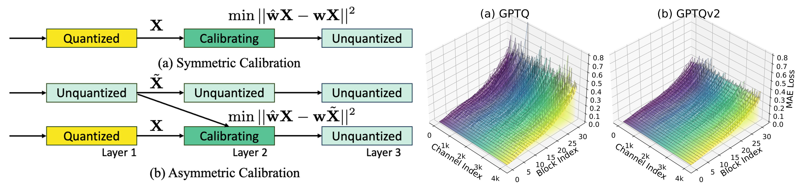

<h1 align="center">  
    <p> GPTAQ: Efficient Finetuning-Free Quantization with Asymmetric Calibration [ICML 2025]</p>
</h1>  
  
<h1 align="center">   
      
</h1>  
  
The official pytorch implementation of GPTAQ.   
  
Unlike the previous GPTQ method, which independently calibrates each layer, we always match the quantized layer’s output to the exact output in the full-precision model, resulting in a scheme that we call asymmetric calibration. Such a scheme can effectively reduce the quantization error accumulated in previous layers. We analyze this problem using optimal brain compression to derive a close-formed solution. The new solution explicitly minimizes the quantization error as well as the accumulated asymmetry error. Furthermore, we utilize various techniques to parallelize the solution calculation, including channel parallelization, neuron decomposition, and Cholesky reformulation for matrix fusion. As a result, GPTAQ is easy to implement, simply using 20 more lines of code than GPTQ but improving its performance under low-bit quantization.  
  
## Update: Name change to GPTAQ

We are updating our code to the new name *`GPTAQ`*

## Update: GPTQv2 is integrated into GPTQModel

The GPTQv2 method is integrated into [GPTQModel](https://github.com/ModelCloud/GPTQModel/tree/main) library, with a simple argument to perform. 

You can install GPTQModel:

```shell
pip install -v gptqmodel --no-build-isolation
```

Quantize LLaMA3.1-8B-Instruct

```python
import tempfile

from datasets import load_dataset
from gptqmodel import GPTQModel, QuantizeConfig
from gptqmodel.quantization import FORMAT
from gptqmodel.utils.eval import EVAL
from logbar import LogBar

log = LogBar.shared()

MODEL_ID = "meta-llama/Llama-3.1-8B-Instruct"
CFG_BITS = 4
CFG_GROUPSIZE = 128
CFG_V2 = True
INPUTS_MAX_LENGTH = 2048 # in tokens
QUANT_SAVE_PATH = f"/your_path/gptq_v2_{CFG_V2}_bit_{CFG_BITS}_gpsize_{CFG_GROUPSIZE}_llama_3.1_8B_Instruct"

def get_calib_data(tokenizer, rows: int):

    calibration_dataset = load_dataset(
        "json",
        data_files="/your_path/dataset/c4-train.00000-of-01024.json.gz",
        split="train")

    datas = []
    for index, sample in enumerate(calibration_dataset):
        tokenized = tokenizer(sample["text"])
        if len(tokenized.data['input_ids']) <= INPUTS_MAX_LENGTH:
            datas.append(tokenized)
            if len(datas) >= rows:
                break

    return datas

quant_config = QuantizeConfig(
    bits=CFG_BITS,
    group_size=CFG_GROUPSIZE,
    format=FORMAT.GPTQ,
    desc_act=True,
    sym=True,
    v2=CFG_V2,
)

log.info(f"QuantConfig: {quant_config}")
log.info(f"Save Path: {QUANT_SAVE_PATH}")

# load un-quantized native model
model = GPTQModel.load(MODEL_ID, quant_config)

# load calibration data
calibration_dataset = get_calib_data(tokenizer=model.tokenizer, rows=256)

model.quantize(calibration_dataset, batch_size=1)

model.save(QUANT_SAVE_PATH)
log.info(f"Quant Model Saved to: {QUANT_SAVE_PATH}")
```

Evaluation on Arc_challenge and GSM8K:

```python
# eval
from lm_eval.tasks import TaskManager
from lm_eval.utils import make_table

with tempfile.TemporaryDirectory() as tmp_dir:
    results = GPTQModel.eval(
        QUANT_SAVE_PATH,
        tasks=[EVAL.LM_EVAL.ARC_CHALLENGE, EVAL.LM_EVAL.GSM8K_PLATINUM_COT],
        apply_chat_template=True,
        random_seed=898,
        output_path= tmp_dir,
    )

    print(make_table(results))
    if "groups" in results:
        print(make_table(results, "groups"))
```


Performance comparison (GPTQv2 outperforms GPTQ on GSM8K using 1 fewer bit): 


v1 ([checkpoints](https://huggingface.co/ModelCloud/GPTQ-v1-Llama-3.1-8B-Instruct
)):


|      Tasks       |Version|     Filter     |n-shot|  Metric   |   |Value |   |Stderr|
|------------------|------:|----------------|-----:|-----------|---|-----:|---|-----:|
|arc_challenge|      1|none  |     0|acc     |↑  |0.5000|±  |0.0146|
|             |       |none  |     0|acc_norm|↑  |0.5128|±  |0.0146|
|gsm8k_platinum_cot|      3|flexible-extract|     8|exact_match|↑  |0.3995|±  |0.0141|
|                  |       |strict-match    |     8|exact_match|↑  |0.2548|±  |0.0125|


v2 ([checkpoints](https://huggingface.co/ModelCloud/GPTQ-v2-Llama-3.1-8B-Instruct)):

|      Tasks       |Version|     Filter     |n-shot|  Metric   |   |Value |   |Stderr|
|------------------|------:|----------------|-----:|-----------|---|-----:|---|-----:|
|arc_challenge|      1|none  |     0|acc     |↑  |0.5034|±  |0.0146|
|             |       |none  |     0|acc_norm|↑  |0.5068|±  |0.0146|
|gsm8k_platinum_cot|      3|flexible-extract|     8|exact_match|↑  |0.7601|±  |0.0123|
|                  |       |strict-match    |     8|exact_match|↑  |0.5211|±  |0.0144|


## Code Structure  
  
We provide several directories to reproduce the paper results.   
  
1. [**fake_quant**](./fake_quant) for reproducing QuaRot+GPTQ/GPTAQ   
2. [**spinquant**](./spinquant) for reproducing SpinQuant+GPTQ/GPTAQ  
3. [**vit_quant**](./vit_quant) for reproducing vision transformer quantization results  

[//]: # (4. **GPTQModel**, a forked version of GPTQModel to support GPTQv2 to deploy weight-only quantization model  )
  
We recommend use separate envrionments for different experiments to ensure results are matched.


## Acknowledgement

Our code is built upon several repository:

[https://github.com/IST-DASLab/gptq](https://github.com/IST-DASLab/gptq)

[https://github.com/spcl/QuaRot](https://github.com/spcl/QuaRot)

[https://github.com/facebookresearch/SpinQuant/tree/main](https://github.com/facebookresearch/SpinQuant/tree/main)


## Star Histroy
[](https://star-history.com/#Intelligent-Computing-Lab-Yale/GPTAQ)

## Contact

Yuhang Li (*yuhang.li@yale.edu*)

## Citations  
  
If you find our work useful, please consider giving a star and citation:  
```bibtex  
@article{li2025gptqv2,
      title={GPTAQ: Efficient Finetuning-Free Quantization for Asymmetric Calibration}, 
      author={Yuhang Li and Ruokai Yin and Donghyun Lee and Shiting Xiao and Priyadarshini Panda},
      year={2025},
      journal={arXiv preprint arXiv:2504.02692},
}
```
